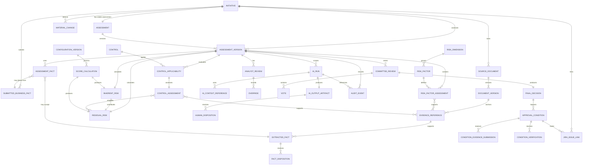

# FULCRUM domain model and entity relationships

Status: Step 6.1 conceptual model. This document defines business entities, ownership, lifecycle, lineage, and versioning before physical PostgreSQL design. It does not define tables, indexes, migrations, or ORM mappings.

The domain model preserves five distinct representations of a proposed change:

```text
Product Owner submission
    → AI extraction/inference
    → analyst-accepted assessment facts
    → deterministic calculation
    → analyst recommendation/override
    → committee decision
```

No later representation overwrites an earlier one.

## 1. Domain entity catalogue

### Initiative and assessment

| Entity | Purpose and key attributes | Lifecycle | Authority | Classification |
|---|---|---|---|---|
| `Initiative` | Primary business-change aggregate: `initiativeId`, name, type, description, justification, owner, participants, lifecycle, target date, tenant/scope | Draft → Active assessment → Decided → Closed/reassessment | FULCRUM; Product Owner supplies proposal, FULCRUM owns lifecycle | Mutable current projection; history preserved by events/versions |
| `ChangeRequest` | Compatibility alias for legacy terminology; references an `initiativeId` and does not become a second record | N/A | FULCRUM naming compatibility | Value/alias, not a separate aggregate |
| `Assessment` | Stable assessment identity associated with an Initiative; current version pointer and assessment purpose/type | Open → Versioned review → Final decision → Reassessment | FULCRUM | Mutable identity/current pointer; versions immutable |
| `AssessmentVersion` | Complete historical assessment snapshot: `versionId`, parent version, state, accepted facts, findings, controls, scores, recommendations, package hash | Draft → Review → Decision ready → Final decision → Superseded/reassessed | FULCRUM, with human review gates | Immutable after finalization; draft may be mutable until gated |
| `WorkflowState` | State value and transition configuration; current state is held by Initiative/AssessmentVersion | Configured states and valid transitions | Deterministic workflow service | Value/configuration; transition events immutable |
| `WorkflowTransition` | Append-only record of from/to state, actor, reason, expected version, timestamp, and correlation ID | Created once | Deterministic system with authenticated actor | Immutable |

### Submitted and accepted facts

| Entity | Purpose and key attributes | Lifecycle | Authority | Classification |
|---|---|---|---|---|
| `SubmittedBusinessFact` | Product Owner-provided value from form or submission: field, value, source, submitted by, submitted at | Submitted → Accepted/clarified/superseded | Product Owner submission; FULCRUM records it | Immutable submission record |
| `ExtractedFact` | AI/document-processing interpretation: value, type, confidence, source evidence, extraction run, model metadata | Proposed → Accepted/corrected/rejected/superseded | AI proposes; source document remains authoritative | Immutable AI output |
| `AssessmentFact` | Version-scoped fact used by assessment/scoring; value, normalized type, provenance, disposition, confidence/quality | Proposed → Accepted → Superseded by new version | FCRM Analyst accepts/corrects; FULCRUM stores | Versioned authoritative assessment input |
| `FactDisposition` | Human action on an extracted/submitted fact: accepted, corrected, rejected, reason, actor, timestamp, replacement reference | Recorded once per action | FCRM Analyst | Immutable |
| `FactProvenance` | Value object identifying origin type, source IDs, locator, extraction run, and disposition | Follows referenced record | Source-specific; FULCRUM preserves | Immutable value object |

`AssessmentFact` is the authoritative fact representation for a particular assessment version. It may point to a direct Product Owner submission, an accepted AI extraction, or an analyst correction. It must never erase the original source or AI output.

### Documents and evidence

| Entity | Purpose and key attributes | Lifecycle | Authority | Classification |
|---|---|---|---|---|
| `SourceDocument` | Logical uploaded or referenced document: document ID, filename, classification, owner, Initiative link | Registered → Active → Retained/withdrawn | Original source owner; FULCRUM tracks reference | Mutable metadata; versions preserved |
| `DocumentVersion` | Immutable bytes/content identity, version, checksum, upload actor/time, malware result, retention metadata | Uploaded → Validated → Processed → Superseded/retained | Original uploaded content | Immutable |
| `EvidenceReference` | Claim-supporting pointer to a document version or direct submission, with page, section, table/cell, span, and quote/hash | Created → Validated → Retained | Source document/submission; FULCRUM maintains link | Immutable |
| `EvidenceAssessmentLink` | Version-scoped statement of how evidence supports, contradicts, or leaves a fact/risk/control unresolved | Proposed → Accepted/challenged | FCRM Analyst disposition | Versioned/immutable after finalization |
| `DocumentProcessingRun` | Document Intelligence extraction status, method, service/model version, timestamps, confidence, errors | Queued → Processing → Completed/Failed | Processing service metadata; FULCRUM records result | Immutable execution record |

Original document versions are authoritative. Extracted text, chunks, embeddings, summaries, and indexes are derived artifacts and can be regenerated without changing the source.

### Risk and controls

| Entity | Purpose and key attributes | Lifecycle | Authority | Classification |
|---|---|---|---|---|
| `RiskDimension` | Configured taxonomy dimension such as geography, customer, product/service, channel, transaction, or third party | Draft → Published → Retired | FCRM configuration owner | Versioned configuration |
| `RiskFactor` | Taxonomy factor definition under a dimension; factor ID, description, applicability rules | Draft → Published → Retired | FCRM configuration owner | Versioned configuration |
| `RiskFactorAssessment` | Version-scoped assessment of a factor: input rating, rationale, evidence/fact links, confidence, completeness | Proposed → Analyst reviewed → Finalized/superseded | FCRM Analyst accepts; deterministic service consumes validated input | Versioned assessment record |
| `InherentRisk` | Risk before controls: factor references, score, rating, calculation/config version, rationale | Calculated → Reviewed → Superseded | Deterministic scoring service; analyst reviews | Immutable calculation result |
| `Control` | Reusable control-library definition: objective, scope, owner, control type | Draft → Published → Retired | FCRM/control owner | Versioned configuration |
| `ControlApplicability` | Version-scoped decision that a control applies, does not apply, or requires clarification, with reason | Proposed → Analyst accepted → Superseded | FCRM Analyst | Versioned |
| `ControlAssessment` | Version-scoped design/operating assessment, evidence links, gaps, and applicability | Proposed → Reviewed → Finalized | FCRM Analyst/control owner evidence | Versioned |
| `ControlEffectiveness` | Value object/result such as effective, partial, ineffective, unknown plus rationale | Proposed → Accepted → Superseded | FCRM Analyst; deterministic scoring consumes it | Versioned value |
| `ResidualRisk` | Inherent risk reference plus applicable control assessments, mitigation inputs, score/rating, configuration, and disposition | Calculated → Analyst reviewed → Finalized/superseded | Deterministic system calculates; analyst may recommend a different value through Override | Immutable calculation/result record |
| `ScoreCalculation` | Full calculation input snapshot, formula/configuration version, intermediate results, threshold lookup, output, trace | Created once per calculation | Deterministic scoring service | Immutable |

Controls mitigate risk; they do not remove the underlying inherent risk. A control change creates a new calculation and, where material, a new AssessmentVersion.

### Policy and regulatory knowledge

| Entity | Purpose and key attributes | Lifecycle | Authority | Classification |
|---|---|---|---|---|
| `RegulatoryFramework` | Jurisdiction/framework identity and applicability metadata | Candidate → Approved → Retired | Qualified policy/legal owner | Versioned reference |
| `PolicyGuidanceDocument` | Internal policy, external guidance, or research source metadata | Discovered → Approved → Retired | Source owner/approved FCRM or legal owner | Versioned reference |
| `PolicyVersion` | Effective content snapshot, version, effective dates, checksum, approval | Draft → Effective → Superseded | Policy owner | Immutable once effective |
| `PolicySectionCitation` | Precise section/page/paragraph citation and interpretation boundary | Created → Reviewed → Retained | Source document plus FCRM interpretation | Immutable |
| `AssessmentEvidenceLink` | Version-scoped link from risk/control/fact conclusion to policy or regulatory citation | Proposed → Analyst accepted → Superseded | FCRM Analyst; source remains authoritative | Versioned |
| `RetrievalChunk` / `Embedding` | Search index representation for approved source content | Indexed → Reindexed/expired | Derived retrieval system | Disposable/derived; never authoritative |

Synthetic policy references in the Golden Initiative are clearly marked demo-only and are not regulatory conclusions.

### AI execution and review

| Entity | Purpose and key attributes | Lifecycle | Authority | Classification |
|---|---|---|---|---|
| `AIRun` | One bounded execution: task, Initiative/version, provider/deployment, prompt version, context manifest, timestamps, token/cost metadata | Started → Completed/Failed/Cancelled | AI Gateway records; FULCRUM governs scope | Immutable execution record |
| `AITaskType` | Versioned capability contract such as extraction, gap detection, risk analysis, retrieval synthesis, summary, or Q&A | Draft → Published → Retired | AI/FCRM governance owner | Versioned configuration |
| `AIOutputArtifact` | Structured output/recommendation, source citations, schema validation, uncertainty, limitations | Proposed → Reviewed/accepted/edited/rejected | AI proposes; analyst disposition governs use | Immutable output |
| `AIContextReference` | Context manifest entry for each input/retrieved source, access decision, version, freshness, and hash | Created with run | AI Gateway and authorization layer | Immutable |
| `AIEvaluationResult` | Test/evaluation outcome for an AI run or model/configuration: metric, dataset, expected result, reviewer | Recorded → Reviewed | Evaluation process/human reviewer | Immutable |
| `HumanDisposition` | Human acceptance, edit, rejection, or override of an AI artifact, with actor, reason, evidence, and downstream effect | Recorded once per action | FCRM Analyst or authorized reviewer | Immutable |

Hidden chain-of-thought is not a domain entity. Store business-relevant outputs, citations, structured rationale, uncertainty, and provenance only.

### Analyst and committee governance

| Entity | Purpose and key attributes | Lifecycle | Authority | Classification |
|---|---|---|---|---|
| `AnalystReview` | Review session/outcome for an AssessmentVersion: completeness, evidence challenges, accepted findings, recommendation | Open → In review → Finalized | FCRM Analyst | Versioned/immutable after finalization |
| `RecommendationDisposition` | Analyst’s final recommendation, rationale, supporting references, and relationship to system calculation | Draft → Finalized → Superseded by reassessment | FCRM Analyst | Versioned |
| `Override` | Difference between original calculated/recommended value and human value, with rationale, actor, evidence, timestamp, impact, and disposition | Recorded once | FCRM Analyst under capability policy | Immutable |
| `CommitteeReview` | Decision package review context, assigned members, assessment version, quorum rule, and review status | Prepared → In review → Finalized | Risk Committee | Versioned/immutable after finalization |
| `CommitteeMember` | User/role reference and assignment to a CommitteeReview | Assigned → Active → Removed | FULCRUM identity/governance | Mutable assignment; history preserved |
| `Vote` | Individual member vote, rationale/comment, timestamp, and package/version reference | Cast → Amended only by compensating record | Committee member | Immutable |
| `FinalDecision` | Authoritative committee outcome, rationale, decision maker, package/version reference, and conditions | Recorded → Reassessed if material change | Risk Committee | Immutable |

Individual votes are not the final decision. The `FinalDecision` is a separate authoritative record.

### Conditions, Jira, configuration, and audit

| Entity | Purpose and key attributes | Lifecycle | Authority | Classification |
|---|---|---|---|---|
| `ApprovalCondition` | Conditional obligation: description, owner, due date, status, decision/version, Jira link | Open → In progress → Verified/Overdue/Waived | FULCRUM; owner supplies evidence, authorized reviewer verifies | Mutable operational status with immutable history |
| `ConditionOwner` | User/team assignment and responsibility metadata | Assigned → Reassigned/closed | FULCRUM governance | Mutable with history |
| `ConditionEvidenceSubmission` | Evidence submitted for completion, source reference, submitter, timestamp | Submitted → Accepted/rejected | Condition owner submits; verifier decides | Immutable submission |
| `ConditionVerification` | Verification outcome, reviewer, rationale, timestamp | Pending → Verified/rejected | Authorized FCRM reviewer | Immutable |
| `ConditionWaiver` | Authorized waiver reason, authority, expiry, and evidence | Proposed → Approved/rejected/expired | Authorized governance role | Immutable |
| `JiraConnection` | FULCRUM-side OAuth connection metadata, scopes, tenant/cloud identity, status, last sync | Connected → Degraded/disconnected/revoked | External Jira authorization plus FULCRUM connection owner | Mutable status; credential material external/secret-managed |
| `JiraIssueLink` | Link between Initiative/Condition and Jira issue ID/key, correlation ID, sync status, freshness, last error | Linked → Synced/stale/unlinked | FULCRUM link; Jira owns issue content | Mutable projection with sync history |
| `ConfigurationVersion` | Effective scoring, thresholds, weights, taxonomy, workflow, material-change, or quorum configuration | Draft → Approved → Effective → Superseded | Authorized configuration owner | Immutable once effective |
| `MaterialChange` | Detected change, source fact/evidence, affected dimensions, materiality decision, reason, and resulting version | Detected → Reviewed → Applied/rejected | FCRM Analyst/governance policy | Immutable event/decision |
| `AuditEvent` | Append-only event with actor, action, entity/version, before/after references, justification, correlation ID, AI run, and hash | Appended once | FULCRUM audit subsystem | Immutable |

## 2. Entity relationship diagram



## 3. Aggregate boundaries

### Initiative aggregate

Owns the business-change identity, lifecycle, participants, submitted facts, document references, assessment identity, linked conditions, and FULCRUM-side Jira links. Its invariants include stable identity, authorized ownership, and no silent lifecycle mutation.

### Assessment aggregate

`Assessment` is the stable identity; `AssessmentVersion` is the historical decision snapshot. A version owns accepted assessment facts, risk-factor assessments, control assessments, score calculations, analyst review, AI dispositions, and the committee package for that version. Finalized versions are immutable. Cross-aggregate references use stable IDs and version IDs.

### Evidence aggregate

`SourceDocument` owns immutable document versions and processing metadata. Evidence references point into a specific version. It is separate because source retention, extraction retries, access control, and provenance have different lifecycles from assessment decisions.

### Knowledge aggregate

Policy/regulatory documents, effective versions, sections, and citations are governed separately from assessments. Retrieval chunks and embeddings are derived projections.

### AI execution aggregate

An `AIRun` owns its context manifest and output artifacts. It may propose artifacts for an assessment but cannot mutate an Initiative, AssessmentVersion, score, workflow state, condition, or decision.

### Governance aggregate

Analyst review, overrides, committee review, votes, final decision, and conditions preserve human actions and obligations. A committee decision references an exact AssessmentVersion and decision-package snapshot.

### Audit boundary

Audit events are append-only records emitted by authoritative commands and are not ordinary child rows that can be edited with the business entity. Operational status may be mutable; historical audit remains immutable.

## 4. Data authority matrix

| Data | Initial source | Authoritative representation | Human/system authority |
|---|---|---|---|
| Initiative proposal and business justification | Product Owner | `Initiative` submitted fields plus immutable submission event | Product Owner submits; FULCRUM records |
| Document bytes and original content | Product Owner or approved source | `DocumentVersion` | Source document; FULCRUM preserves |
| Extracted text/layout/tables | Document Intelligence | `DocumentProcessingRun` output linked to `DocumentVersion` | AI/service proposes; source remains authoritative |
| Extracted fact | AI/document run | `ExtractedFact` | AI proposes; Analyst disposition determines usability |
| Accepted assessment fact | Analyst review of submission/evidence | `AssessmentFact` for an `AssessmentVersion` | FCRM Analyst |
| Risk taxonomy/dimension | FCRM configuration owner | Published `RiskDimension`/`RiskFactor` version | FCRM governance |
| Risk-factor assessment input | Analyst validation, supported by evidence | `RiskFactorAssessment` | Analyst accepts; source links required |
| Inherent risk score | Validated inputs and configuration | `InherentRisk` + `ScoreCalculation` | Deterministic system |
| Control applicability/effectiveness | Control evidence and analyst review | `ControlApplicability`/`ControlAssessment` | Analyst/control owner; evidence required |
| Residual risk score | Inherent risk, controls, configuration | `ResidualRisk` + `ScoreCalculation` | Deterministic system |
| AI recommendation/rationale | AI Gateway | Immutable `AIOutputArtifact` | AI proposes only |
| Recommendation disposition | Analyst review | `HumanDisposition`/`RecommendationDisposition` | FCRM Analyst |
| Override | Analyst judgment against original value | `Override` | FCRM Analyst under policy |
| Final decision | Committee vote/review | `FinalDecision` | Risk Committee |
| Approval condition status | Owner submission and verifier action | `ApprovalCondition` plus verification history | FULCRUM workflow; authorized verifier |
| Jira issue content/status | Jira | FULCRUM `JiraIssueLink` projection with freshness metadata | Jira owns external content; FULCRUM owns decision meaning |
| Scoring/workflow parameters | Approved configuration change | Effective `ConfigurationVersion` | Authorized configuration owner |
| Audit history | Authoritative FULCRUM commands/services | Append-only `AuditEvent` | FULCRUM audit subsystem |

## 5. Traceability walkthrough

Example: sanctions exposure for the Golden Initiative.

1. `DocumentVersion DOC-006` represents the synthetic Partner Due Diligence Evidence Pack. `EvidenceReference EV-006` points to its Items 1–8 locator.
2. `ExtractedFact FACT-006-2` records that beneficial-ownership evidence is pending. The extraction run, document version, page/section locator, timestamp, and confidence are retained.
3. Daniel Reyes reviews the extraction. The accepted `AssessmentFact` for Assessment Version 1 retains the source reference and analyst disposition; the original extraction remains unchanged.
4. `RiskFactorAssessment RF-SAN-01` identifies sanctions exposure and links to the accepted fact, `EV-006`, the synthetic policy citations `POL-001`/`POL-002`, and controls `CTL-002`/`CTL-004`.
5. The deterministic `ScoreCalculation` uses the versioned synthetic scoring configuration and all validated risk/control inputs. `InherentRisk` and `ResidualRisk` preserve the calculation inputs, intermediate results, thresholds, and output rating.
6. `AIOutputArtifact AIO-001` recommends high residual risk because partner diligence and enhanced monitoring evidence are incomplete. Its `AIRun` records task, model/deployment, prompt version, and context references.
7. Daniel records a `HumanDisposition`/`Override` preserving the original recommendation, final analyst value, rationale, evidence references, actor, timestamp, and downstream impact. The system-calculated residual risk remains visible.
8. `CommitteeReview` references Assessment Version 1 and its decision package. Helen Morgan’s `Vote` and the separate `FinalDecision` record `APPROVED_WITH_CONDITIONS`, with conditions for partner diligence and enhanced monitoring.
9. `AuditEvent`s connect each transition, extraction, AI run, disposition, override, vote, decision, and condition action using entity/version IDs and correlation IDs.

## 6. Versioning touchpoints

Version or preserve history for:

- `Initiative` lifecycle and submitted facts through events and assessment references.
- `AssessmentVersion`, including parent/previous version and supersession reason.
- `DocumentVersion` and source checksum.
- `ExtractedFact` and every `FactDisposition`; corrections create new records.
- `AssessmentFact`, `RiskFactorAssessment`, `ControlApplicability`, and `ControlAssessment`.
- `InherentRisk`, `ResidualRisk`, and `ScoreCalculation`.
- `RiskDimension`, `RiskFactor`, `Control`, and `ConfigurationVersion`.
- `PolicyVersion`, `PolicySectionCitation`, and assessment evidence links.
- `AIRun`, `AIOutputArtifact`, `AIContextReference`, and `AIEvaluationResult`.
- `AnalystReview`, `RecommendationDisposition`, `Override`, `CommitteeReview`, `Vote`, and `FinalDecision`.
- `ApprovalCondition`, evidence submissions, verifications, and waivers.
- Jira link synchronization status and external snapshot metadata.
- Every `AuditEvent`; no destructive update/delete path.

Material change flow:

```text
new submission/evidence/configuration
→ MaterialChange
→ affected RiskDimension[]
→ new AssessmentVersion(parentVersionId)
→ selective invalidation/recalculation
→ analyst review
→ decision package for the new version
```

Finalized historical versions remain unchanged.

## 7. Open questions before physical schema design

These are the remaining genuine data-model decisions:

1. Is `AssessmentVersion` the complete immutable snapshot, or do finalized child records require independent snapshot IDs for export/replay?
2. Which fields are allowed to differ between deterministic `ResidualRisk` and `RecommendationDisposition`, and what policy category is required for an override?
3. Is a committee quorum configurable per Initiative type, and how are abstentions, recusals, and replacement votes represented?
4. Does condition tracking belong under the Initiative, the FinalDecision, or both through a single canonical owner/reference?
5. What is the conflict-resolution rule when Product Owner input, extracted facts, and analyst corrections disagree?
6. What source snapshot and citation retention period is required for external regulatory material and internal policy versions?
7. What tenant/business-unit/assignment scope is mandatory on every aggregate for production authorization?
8. Which material-change rules invalidate each risk dimension and which changes require a full reassessment?
9. What evidence classification, retention, deletion/legal-hold, and document-size rules apply before physical storage is designed?

## 8. Risks and over-modeling review

| Candidate | Recommendation |
|---|---|
| Separate `ChangeRequest` aggregate | Do not create it. Keep it as a compatibility alias to `Initiative`. |
| Separate `WorkflowState` entity | Use a state value plus governed configuration and immutable transition events; do not create a rich state aggregate for the hackathon. |
| Nine autonomous AI agents | Do not model each as a business entity. Use `AITaskType`, `AIRun`, and output artifacts behind one orchestrator. |
| Separate `InherentRisk` and `ResidualRisk` | Keep them separate because examiner explanation and scoring semantics require the distinction. |
| Separate policy, section, citation, chunk, and embedding records | Keep authoritative policy/version/citation records; defer physical chunk/embedding detail to retrieval design. |
| Separate condition owner entity | Use a user/team reference value object initially; preserve assignment history through events. |
| Full multi-tenant model now | Include scope identifiers in the conceptual model, but defer enterprise tenant administration. |
| Separate Jira mirror of every issue field | Store only FULCRUM link/correlation/freshness metadata and selected evidence snapshots. Jira remains external authority for Jira content. |
| Event-sourced entire domain | Use append-only audit/domain events plus versioned records; do not require full event sourcing for the hackathon. |

## Domain Model Verdict

### READY WITH QUESTIONS

The conceptual model is coherent enough to proceed to physical design after the open questions affecting snapshot boundaries, overrides, conditions, committee rules, and authorization scope are answered. It preserves source, AI, deterministic, analyst, and committee authority separately.

## Required Before 6.2

1. Confirm that the AssessmentVersion is the immutable historical decision boundary.
2. Confirm the canonical relationship between FinalDecision and ApprovalCondition.
3. Confirm the override policy and representation of analyst values that differ from deterministic results.
4. Confirm minimum tenant/assignment scope fields required by authorization.
5. Confirm the material-change to affected-dimensions relationship.

## Ready for 6.2?

### YES, CONDITIONALLY

Proceed to physical schema design once the five decisions above are recorded. No physical tables or migrations should be created until those decisions are resolved.

