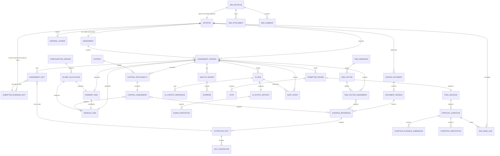

# FULCRUM domain model and entity relationships

Status: Step 6.1 conceptual model. This document defines business entities, ownership, lifecycle, lineage, and versioning before physical PostgreSQL design. It does not define tables, indexes, migrations, or ORM mappings.

The domain model preserves five distinct representations of a proposed change while keeping authority boundaries explicit:

```text
Product Owner submission
    → AI extraction/inference
    → analyst-accepted assessment facts
    → deterministic calculation
    → analyst recommendation/override
    → committee decision
```

No later representation overwrites an earlier one.

## Authority boundary

The underlying initiative remains Jira-authoritative. FULCRUM references Jira initiative data and persists only the FCRM-specific state or historical snapshot needed for governed assessment and replay.

| Classification | Meaning | Examples |
|---|---|---|
| `JIRA_AUTHORITATIVE` | Jira owns the current business/collaboration value | Initiative title, description, assignee, comments, attachments, due dates, Jira workflow/history |
| `FULCRUM_AUTHORITATIVE` | FULCRUM owns the governed FCRM value | Assessment versions, accepted facts, risk, controls, scores, overrides, decisions, conditions, audit |
| `REFERENCED_FROM_JIRA` | FULCRUM stores stable external identifiers and selected metadata | Jira issue/attachment/comment links, sync status, source locator, freshness |
| `SNAPSHOTTED_FOR_AUDIT` | FULCRUM stores a bounded content hash or selected source snapshot because a finalized assessment relied on it | Jira attachment/comment evidence hash, extracted text/source span, retrieved policy content |

The assessment, not the Jira issue, is the FULCRUM aggregate root for governed risk decisions. `Initiative` in this model means the FULCRUM-side reference/context boundary for a Jira initiative, not ownership of the full Jira issue model.

## 1. Domain entity catalogue

### Initiative and assessment

| Entity | Purpose and key attributes | Lifecycle | Authority | Classification |
|---|---|---|---|---|
| `Initiative` | FULCRUM-side reference to Jira initiative: `initiativeId`, `jiraIssueId`, selected title/context projection, linked assessment, scope, and sync metadata | Linked → Context available/degraded → Unlinked | Jira for business initiative; FULCRUM for its link and FCRM context | Reference/projection; selected snapshots only |
| `ChangeRequest` | Compatibility alias for legacy terminology; references an `initiativeId` and does not become a second record | N/A | FULCRUM naming compatibility | Value/alias, not a separate aggregate |
| `Assessment` | Stable FULCRUM assessment identity associated with a Jira-backed Initiative; current version pointer and purpose/type | Open → Versioned review → Final decision → Reassessment | FULCRUM | Mutable identity/current pointer; versions immutable |
| `AssessmentVersion` | Complete historical assessment snapshot: `versionId`, parent version, state, accepted facts, findings, controls, scores, recommendations, package hash | Draft → Review → Decision ready → Final decision → Superseded/reassessed | FULCRUM, with human review gates | Immutable after finalization; draft may be mutable until gated |
| `WorkflowState` | State value and transition configuration; current state is held by Initiative/AssessmentVersion | Configured states and valid transitions | Deterministic workflow service | Value/configuration; transition events immutable |
| `WorkflowTransition` | Append-only record of from/to state, actor, reason, expected version, timestamp, and correlation ID | Created once | Deterministic system with authenticated actor | Immutable |

### Submitted and accepted facts

| Entity | Purpose and key attributes | Lifecycle | Authority | Classification |
|---|---|---|---|---|
| `SubmittedBusinessFact` | Business fact submitted through Jira or FULCRUM intake: field, value, Jira issue/comment or form source, submitter, and time | Submitted → Accepted/clarified/superseded | Jira when submitted there; FULCRUM records the assessment-relevant submission/reference | Immutable submission record |
| `ExtractedFact` | AI/document-processing interpretation: value, type, confidence, source evidence, extraction run, model metadata | Proposed → Accepted/corrected/rejected/superseded | AI proposes; source document remains authoritative | Immutable AI output |
| `AssessmentFact` | Version-scoped fact used by assessment/scoring; value, normalized type, provenance, disposition, confidence/quality | Proposed → Accepted → Superseded by new version | FCRM Analyst accepts/corrects; FULCRUM stores | Versioned authoritative assessment input |
| `FactDisposition` | Human action on an extracted/submitted fact: accepted, corrected, rejected, reason, actor, timestamp, replacement reference | Recorded once per action | FCRM Analyst | Immutable |
| `FactProvenance` | Value object identifying origin type, source IDs, locator, extraction run, and disposition | Follows referenced record | Source-specific; FULCRUM preserves | Immutable value object |

`AssessmentFact` is the authoritative fact representation for a particular assessment version. It may point to a direct Product Owner submission, an accepted AI extraction, or an analyst correction. It must never erase the original source or AI output.

Jira comments, attachments, watchers, assignees, due dates, related issues, and general initiative history are external Jira concepts, not duplicated FULCRUM entities. The ERD shows `JIRA_INITIATIVE`, `JIRA_ATTACHMENT`, and `JIRA_COMMENT` only to make the authority boundary visible; Step 6.4 should represent them as external identifiers and selected metadata.

### Documents and evidence

| Entity | Purpose and key attributes | Lifecycle | Authority | Classification |
|---|---|---|---|---|
| `SourceDocument` | FULCRUM reference to a Jira attachment or approved external document: Jira issue ID, attachment ID, filename, content type, classification, source timestamps | Referenced → Available/degraded → Retained reference | Jira attachment is authoritative; FULCRUM stores reference | Reference/projection; no binary copy by default |
| `DocumentVersion` | Exact Jira attachment version or bounded archival snapshot metadata: source version/timestamps, content hash, extraction status, optional archive pointer | Referenced → Validated → Processed → Superseded/retained | Jira source; FULCRUM snapshot/hash when required | Immutable reference/snapshot |
| `EvidenceReference` | Claim-supporting pointer to Jira issue/attachment/comment or direct submission, with source version, page, section, span, quote/hash, and extraction run | Created → Validated → Retained | Jira/source remains authoritative; FULCRUM owns FCRM use and lineage | Immutable |
| `EvidenceAssessmentLink` | Version-scoped statement of how evidence supports, contradicts, or leaves a fact/risk/control unresolved | Proposed → Accepted/challenged | FCRM Analyst disposition | Versioned/immutable after finalization |
| `DocumentProcessingRun` | Document Intelligence extraction status, method, service/model version, timestamps, confidence, errors | Queued → Processing → Completed/Failed | Processing service metadata; FULCRUM records result | Immutable execution record |

Jira attachment and comment versions are authoritative for normal collaboration evidence. Extracted text, chunks, embeddings, summaries, and indexes are derived artifacts and can be regenerated without changing the source. A production banking implementation may archive a governed immutable copy when retention or replay requirements justify it; that is not a full Jira mirror.

### Risk and controls

| Entity | Purpose and key attributes | Lifecycle | Authority | Classification |
|---|---|---|---|---|
| `RiskDimension` | Configured taxonomy dimension such as geography, customer, product/service, channel, transaction, or third party | Draft → Published → Retired | FCRM configuration owner | Versioned configuration |
| `RiskFactor` | Taxonomy factor definition under a dimension; factor ID, description, applicability rules | Draft → Published → Retired | FCRM configuration owner | Versioned configuration |
| `RiskFactorAssessment` | Version-scoped assessment of a factor: input rating, rationale, evidence/fact links, confidence, completeness | Proposed → Analyst reviewed → Finalized/superseded | FCRM Analyst accepts; deterministic service consumes validated input | Versioned assessment record |
| `InherentRisk` | Risk before controls: factor references, score, rating, calculation/config version, rationale | Calculated → Reviewed → Superseded | Deterministic scoring service; analyst reviews | Immutable calculation result |
| `Control` | Reusable control-library definition: objective, scope, owner, control type | Draft → Published → Retired | FCRM/control owner | Versioned configuration |
| `ControlApplicability` | Version-scoped decision that a control applies, does not apply, or requires clarification, with reason | Proposed → Analyst accepted → Superseded | FCRM Analyst | Versioned |
| `ControlAssessment` | Version-scoped design/operating assessment, evidence links, gaps, and applicability | Proposed → Reviewed → Finalized | FCRM Analyst/control owner evidence | Versioned |
| `ControlEffectiveness` | Value object/result such as effective, partial, ineffective, unknown plus rationale | Proposed → Accepted → Superseded | FCRM Analyst; deterministic scoring consumes it | Versioned value |
| `ResidualRisk` | Inherent risk reference plus applicable control assessments, mitigation inputs, score/rating, configuration, and disposition | Calculated → Analyst reviewed → Finalized/superseded | Deterministic system calculates; analyst may recommend a different value through Override | Immutable calculation/result record |
| `ScoreCalculation` | Full calculation input snapshot, formula/configuration version, intermediate results, threshold lookup, output, trace | Created once per calculation | Deterministic scoring service | Immutable |

Controls mitigate risk; they do not remove the underlying inherent risk. A control change creates a new calculation and, where material, a new AssessmentVersion.

### Policy and regulatory knowledge

| Entity | Purpose and key attributes | Lifecycle | Authority | Classification |
|---|---|---|---|---|
| `RegulatoryFramework` | Jurisdiction/framework identity and applicability metadata | Candidate → Approved → Retired | Qualified policy/legal owner | Versioned reference |
| `PolicyGuidanceDocument` | Internal policy, external guidance, or research source metadata | Discovered → Approved → Retired | Source owner/approved FCRM or legal owner | Versioned reference |
| `PolicyVersion` | Effective content snapshot, version, effective dates, checksum, approval | Draft → Effective → Superseded | Policy owner | Immutable once effective |
| `PolicySectionCitation` | Precise section/page/paragraph citation and interpretation boundary | Created → Reviewed → Retained | Source document plus FCRM interpretation | Immutable |
| `AssessmentEvidenceLink` | Version-scoped link from risk/control/fact conclusion to policy or regulatory citation | Proposed → Analyst accepted → Superseded | FCRM Analyst; source remains authoritative | Versioned |
| `RetrievalChunk` / `Embedding` | Search index representation for approved source content | Indexed → Reindexed/expired | Derived retrieval system | Disposable/derived; never authoritative |

Synthetic policy references in the Golden Initiative are clearly marked demo-only and are not regulatory conclusions.

### AI execution and review

| Entity | Purpose and key attributes | Lifecycle | Authority | Classification |
|---|---|---|---|---|
| `AIRun` | One bounded execution: task, Initiative/version, provider/deployment, prompt version, context manifest, timestamps, token/cost metadata | Started → Completed/Failed/Cancelled | AI Gateway records; FULCRUM governs scope | Immutable execution record |
| `AITaskType` | Versioned capability contract such as extraction, gap detection, risk analysis, retrieval synthesis, summary, or Q&A | Draft → Published → Retired | AI/FCRM governance owner | Versioned configuration |
| `AIOutputArtifact` | Structured output/recommendation, source citations, schema validation, uncertainty, limitations | Proposed → Reviewed/accepted/edited/rejected | AI proposes; analyst disposition governs use | Immutable output |
| `AIContextReference` | Context manifest entry for each input/retrieved source, access decision, version, freshness, and hash | Created with run | AI Gateway and authorization layer | Immutable |
| `AIEvaluationResult` | Test/evaluation outcome for an AI run or model/configuration: metric, dataset, expected result, reviewer | Recorded → Reviewed | Evaluation process/human reviewer | Immutable |
| `HumanDisposition` | Human acceptance, edit, rejection, or override of an AI artifact, with actor, reason, evidence, and downstream effect | Recorded once per action | FCRM Analyst or authorized reviewer | Immutable |

Hidden chain-of-thought is not a domain entity. Store business-relevant outputs, citations, structured rationale, uncertainty, and provenance only.

### Analyst and committee governance

| Entity | Purpose and key attributes | Lifecycle | Authority | Classification |
|---|---|---|---|---|
| `AnalystReview` | Review session/outcome for an AssessmentVersion: completeness, evidence challenges, accepted findings, recommendation | Open → In review → Finalized | FCRM Analyst | Versioned/immutable after finalization |
| `RecommendationDisposition` | Analyst’s final recommendation, rationale, supporting references, and relationship to system calculation | Draft → Finalized → Superseded by reassessment | FCRM Analyst | Versioned |
| `Override` | Difference between original calculated/recommended value and human value, with rationale, actor, evidence, timestamp, impact, and disposition | Recorded once | FCRM Analyst under capability policy | Immutable |
| `CommitteeReview` | Decision package review context, assigned members, assessment version, quorum rule, and review status | Prepared → In review → Finalized | Risk Committee | Versioned/immutable after finalization |
| `CommitteeMember` | User/role reference and assignment to a CommitteeReview | Assigned → Active → Removed | FULCRUM identity/governance | Mutable assignment; history preserved |
| `Vote` | Individual member vote, rationale/comment, timestamp, and package/version reference | Cast → Amended only by compensating record | Committee member | Immutable |
| `FinalDecision` | Authoritative committee outcome, rationale, decision maker, package/version reference, and conditions | Recorded → Reassessed if material change | Risk Committee | Immutable |

Individual votes are not the final decision. The `FinalDecision` is a separate authoritative record.

### Conditions, Jira, configuration, and audit

| Entity | Purpose and key attributes | Lifecycle | Authority | Classification |
|---|---|---|---|---|
| `ApprovalCondition` | Conditional obligation: description, owner, due date, status, decision/version, Jira link | Open → In progress → Verified/Overdue/Waived | FULCRUM; owner supplies evidence, authorized reviewer verifies | Mutable operational status with immutable history |
| `ConditionOwner` | FULCRUM user/team assignment; may reference a Jira assignee for execution | Assigned → Reassigned/closed | FULCRUM governance; Jira assignee is execution context | Mutable with history |
| `ConditionEvidenceSubmission` | Evidence submitted for completion, source reference, submitter, timestamp | Submitted → Accepted/rejected | Condition owner submits; verifier decides | Immutable submission |
| `ConditionVerification` | Verification outcome, reviewer, rationale, timestamp | Pending → Verified/rejected | Authorized FCRM reviewer | Immutable |
| `ConditionWaiver` | Authorized waiver reason, authority, expiry, and evidence | Proposed → Approved/rejected/expired | Authorized governance role | Immutable |
| `JiraConnection` | FULCRUM-side OAuth connection metadata, scopes, tenant/cloud identity, status, last sync | Connected → Degraded/disconnected/revoked | External Jira authorization plus FULCRUM connection owner | Mutable status; credential material external/secret-managed |
| `JiraIssueLink` | Correlation between FULCRUM assessment/condition and Jira issue ID/key, sync status, freshness, last error | Linked → Synced/stale/unlinked | Jira owns issue; FULCRUM owns link/usage metadata | Mutable projection with sync history |
| `ConfigurationVersion` | Effective scoring, thresholds, weights, taxonomy, workflow, material-change, or quorum configuration | Draft → Approved → Effective → Superseded | Authorized configuration owner | Immutable once effective |
| `MaterialChange` | Detected change, source fact/evidence, affected dimensions, materiality decision, reason, and resulting version | Detected → Reviewed → Applied/rejected | FCRM Analyst/governance policy | Immutable event/decision |
| `AuditEvent` | Append-only event with actor, action, entity/version, before/after references, justification, correlation ID, AI run, and hash | Appended once | FULCRUM audit subsystem | Immutable |

## 2. Entity relationship diagram



## 3. Aggregate boundaries

### Initiative reference boundary

Jira owns the business-change identity, collaboration, attachments, assignees, due dates, general workflow, and history. FULCRUM stores an Initiative reference with stable Jira identifiers, selected context needed by the assessment, sync/freshness metadata, and any bounded historical snapshot required for finalized evidence. It does not own a parallel Jira issue aggregate.

### Assessment aggregate

`Assessment` is the stable identity; `AssessmentVersion` is the historical decision snapshot. A version owns accepted assessment facts, risk-factor assessments, control assessments, score calculations, analyst review, AI dispositions, and the committee package for that version. Finalized versions are immutable. Cross-aggregate references use stable IDs and version IDs.

### Evidence aggregate

Jira normally owns the attachment binary and comment. FULCRUM owns the evidence reference, extraction/provenance metadata, accepted facts, and any bounded content hash or archive pointer required for finalized assessment replay. It does not copy the Jira attachment by default.

### Knowledge aggregate

Policy/regulatory documents, effective versions, sections, and citations are governed separately from assessments. Retrieval chunks and embeddings are derived projections.

### AI execution aggregate

An `AIRun` owns its context manifest and output artifacts. It may propose artifacts for an assessment but cannot mutate an Initiative, AssessmentVersion, score, workflow state, condition, or decision.

### Governance aggregate

Analyst review, overrides, committee review, votes, final decision, and conditions preserve human actions and obligations. A committee decision references an exact AssessmentVersion and decision-package snapshot.

### Audit boundary

Audit events are append-only records emitted by authoritative commands and are not ordinary child rows that can be edited with the business entity. Operational status may be mutable; historical audit remains immutable.

## 4. Data authority matrix

| Data | Initial source | Authoritative representation | Human/system authority |
|---|---|---|---|
| Initiative title, description, business context | Jira/Product Owner | Jira issue fields; FULCRUM stores selected context or bounded snapshot only when required | Jira |
| Initiative assignee, due dates, comments, watchers, general history | Jira users/collaborators | Jira references and selected provenance metadata | Jira |
| Document bytes and original attachment | Jira attachment | Jira attachment ID/version; FULCRUM stores reference and optional hash/archive pointer | Jira |
| Extracted text/layout/tables | Document Intelligence over Jira attachment | `DocumentProcessingRun` output linked to Jira attachment/version | AI/service proposes; Jira source remains authoritative |
| Extracted fact | AI/document run | `ExtractedFact` | AI proposes; Analyst disposition determines usability |
| Accepted assessment fact | Analyst review of submission/evidence | `AssessmentFact` for an `AssessmentVersion` | FCRM Analyst |
| Risk taxonomy/dimension | FCRM configuration owner | Published `RiskDimension`/`RiskFactor` version | FCRM governance |
| Risk-factor assessment input | Analyst validation, supported by evidence | `RiskFactorAssessment` | Analyst accepts; source links required |
| Inherent risk score | Validated inputs and configuration | `InherentRisk` + `ScoreCalculation` | Deterministic system |
| Control applicability/effectiveness | Control evidence and analyst review | `ControlApplicability`/`ControlAssessment` | Analyst/control owner; evidence required |
| Residual risk score | Inherent risk, controls, configuration | `ResidualRisk` + `ScoreCalculation` | Deterministic system |
| AI recommendation/rationale | AI Gateway | Immutable `AIOutputArtifact` | AI proposes only |
| Recommendation disposition | Analyst review | `HumanDisposition`/`RecommendationDisposition` | FCRM Analyst |
| Override | Analyst judgment against original value | `Override` | FCRM Analyst under policy |
| Final decision | Committee vote/review | `FinalDecision` | Risk Committee |
| Approval condition status | Owner submission and verifier action | `ApprovalCondition` plus verification history | FULCRUM workflow; authorized verifier |
| Jira issue content/status | Jira | `JiraIssueLink` correlation, freshness, and selected snapshot/hash only | Jira owns external content; FULCRUM owns decision meaning |
| Scoring/workflow parameters | Approved configuration change | Effective `ConfigurationVersion` | Authorized configuration owner |
| Audit history | Authoritative FULCRUM commands/services | Append-only `AuditEvent` | FULCRUM audit subsystem |

## 5. Traceability walkthrough

Example: sanctions exposure for the Golden Initiative.

1. `DocumentVersion DOC-006` represents the synthetic Partner Due Diligence Evidence Pack. `EvidenceReference EV-006` points to its Items 1–8 locator.
2. `ExtractedFact FACT-006-2` records that beneficial-ownership evidence is pending. The extraction run, document version, page/section locator, timestamp, and confidence are retained.
3. Daniel Reyes reviews the extraction. The accepted `AssessmentFact` for Assessment Version 1 retains the source reference and analyst disposition; the original extraction remains unchanged.
4. `RiskFactorAssessment RF-SAN-01` identifies sanctions exposure and links to the accepted fact, `EV-006`, the synthetic policy citations `POL-001`/`POL-002`, and controls `CTL-002`/`CTL-004`.
5. The deterministic `ScoreCalculation` uses the versioned synthetic scoring configuration and all validated risk/control inputs. `InherentRisk` and `ResidualRisk` preserve the calculation inputs, intermediate results, thresholds, and output rating.
6. `AIOutputArtifact AIO-001` recommends high residual risk because partner diligence and enhanced monitoring evidence are incomplete. Its `AIRun` records task, model/deployment, prompt version, and context references.
7. Daniel records a `HumanDisposition`/`Override` preserving the original recommendation, final analyst value, rationale, evidence references, actor, timestamp, and downstream impact. The system-calculated residual risk remains visible.
8. `CommitteeReview` references Assessment Version 1 and its decision package. Helen Morgan’s `Vote` and the separate `FinalDecision` record `APPROVED_WITH_CONDITIONS`, with conditions for partner diligence and enhanced monitoring.
9. `AuditEvent`s connect each transition, extraction, AI run, disposition, override, vote, decision, and condition action using entity/version IDs and correlation IDs.

## 6. Versioning touchpoints

Version or preserve history for:

- `Initiative` lifecycle and submitted facts through events and assessment references.
- `AssessmentVersion`, including parent/previous version and supersession reason.
- `DocumentVersion` and source checksum.
- `ExtractedFact` and every `FactDisposition`; corrections create new records.
- `AssessmentFact`, `RiskFactorAssessment`, `ControlApplicability`, and `ControlAssessment`.
- `InherentRisk`, `ResidualRisk`, and `ScoreCalculation`.
- `RiskDimension`, `RiskFactor`, `Control`, and `ConfigurationVersion`.
- `PolicyVersion`, `PolicySectionCitation`, and assessment evidence links.
- `AIRun`, `AIOutputArtifact`, `AIContextReference`, and `AIEvaluationResult`.
- `AnalystReview`, `RecommendationDisposition`, `Override`, `CommitteeReview`, `Vote`, and `FinalDecision`.
- `ApprovalCondition`, evidence submissions, verifications, and waivers.
- Jira link synchronization status and external snapshot metadata.
- Every `AuditEvent`; no destructive update/delete path.

Material change flow:

```text
new submission/evidence/configuration
→ MaterialChange
→ affected RiskDimension[]
→ new AssessmentVersion(parentVersionId)
→ selective invalidation/recalculation
→ analyst review
→ decision package for the new version
```

Finalized historical versions remain unchanged.

## 7. Open questions before physical schema design

These are the remaining genuine data-model decisions:

1. Is `AssessmentVersion` the complete immutable snapshot, or do finalized child records require independent snapshot IDs for export/replay?
2. Which fields are allowed to differ between deterministic `ResidualRisk` and `RecommendationDisposition`, and what policy category is required for an override?
3. Is a committee quorum configurable per Initiative type, and how are abstentions, recusals, and replacement votes represented?
4. Does condition tracking belong under the Initiative, the FinalDecision, or both through a single canonical owner/reference?
5. What is the conflict-resolution rule when Product Owner input, extracted facts, and analyst corrections disagree?
6. What source snapshot and citation retention period is required for external regulatory material and internal policy versions?
7. What tenant/business-unit/assignment scope is mandatory on every aggregate for production authorization?
8. Which material-change rules invalidate each risk dimension and which changes require a full reassessment?
9. What evidence classification, retention, deletion/legal-hold, and document-size rules apply before physical storage is designed?

## 8. Risks and over-modeling review

| Candidate | Recommendation |
|---|---|
| Separate `ChangeRequest` aggregate | Do not create it. Keep it as a compatibility alias to `Initiative`. |
| Separate `WorkflowState` entity | Use a state value plus governed configuration and immutable transition events; do not create a rich state aggregate for the hackathon. |
| Nine autonomous AI agents | Do not model each as a business entity. Use `AITaskType`, `AIRun`, and output artifacts behind one orchestrator. |
| Separate `InherentRisk` and `ResidualRisk` | Keep them separate because examiner explanation and scoring semantics require the distinction. |
| Separate policy, section, citation, chunk, and embedding records | Keep authoritative policy/version/citation records; defer physical chunk/embedding detail to retrieval design. |
| Separate condition owner entity | Use a user/team reference value object initially; preserve assignment history through events. |
| Full multi-tenant model now | Include scope identifiers in the conceptual model, but defer enterprise tenant administration. |
| Separate Jira mirror of every issue field | Store only FULCRUM link/correlation/freshness metadata and selected evidence snapshots. Jira remains external authority for Jira content. |
| Event-sourced entire domain | Use append-only audit/domain events plus versioned records; do not require full event sourcing for the hackathon. |

## Revised Physical Schema Scope

The Step 6.4 PostgreSQL design must be materially smaller and centered on governed FCRM state.

### Persist in FULCRUM

- `Assessment` and immutable `AssessmentVersion`
- accepted `AssessmentFact`, extracted facts, and fact dispositions
- Jira-backed `EvidenceReference` and required provenance/hash/snapshot metadata
- risk dimensions/factors and version-scoped risk assessments
- controls, applicability, control assessments, and effectiveness results
- inherent/residual risk and immutable score calculations
- scoring, taxonomy, control, workflow, material-change, and AI configuration versions
- policy/regulatory references and exact citations used by assessments
- AI runs, context references, output artifacts, evaluations, and human dispositions
- analyst reviews, recommendations, overrides, committee reviews, votes, and final decisions
- approval conditions, evidence submissions, verifications, and waivers
- Jira connection/correlation/sync metadata
- append-only audit events and reassessment impact records

### Reference from Jira rather than duplicate

- initiative title, description, general business context, assignee, due dates, watchers, and Jira workflow
- general Jira comments and discussion
- Jira attachment binaries and full attachment history
- related Jira issue/task fields and general execution history
- complete Jira user/collaborator model

FULCRUM may store selected Jira metadata or a bounded content hash/snapshot when a finalized assessment relies on it for evidence, governance, performance, or historical replay. It must not become a general project-management database.

## Updated Authority Matrix

| Domain/Data | Authority | FULCRUM Storage Strategy | Reason |
|---|---|---|---|
| Initiative title/description/business context | Jira | Stable Jira issue ID plus selected projection; snapshot only when assessment-relevant | Avoid duplicate business-initiative master |
| Attachments | Jira | Attachment ID, filename/type/timestamps/hash; optional governed snapshot for finalized evidence | Preserve source authority and replay where required |
| Comments/discussion | Jira | No full mirror; reference exact comment only when used as evidence | Separate collaboration from FCRM record |
| Users/assignees/watchers | Jira/enterprise identity | External IDs and FULCRUM user references for FCRM actors/owners | Avoid duplicate directory and assignment truth |
| General workflow/history | Jira | Link and freshness metadata | Jira owns delivery execution |
| FCRM workflow state | FULCRUM | Assessment state, transition records, and audit events | Governs risk review and human gates |
| Assessment/AssessmentVersion | FULCRUM | Full governed records and immutable historical versions | FULCRUM owns FCRM methodology and decisions |
| Accepted facts | FULCRUM | Version-scoped facts with source/disposition lineage | Analyst-approved scoring inputs |
| Risk scoring/calculations | FULCRUM deterministic system | Inputs, configuration ID, intermediate outputs, and trace | Reproducibility and explainability |
| Controls/control effectiveness | FULCRUM with source evidence | Versioned definitions and assessment results | FCRM mitigation authority |
| AI outputs/provenance | FULCRUM AI Gateway | Runs, context refs, artifacts, model/instruction metadata, dispositions | Governance and human review |
| Analyst overrides | FULCRUM | Original value, human value, rationale, evidence, actor, timestamp | Human accountability |
| Committee votes/final decision | FULCRUM | Package/version, votes, decision, rationale, conditions | Authoritative FCRM outcome |
| Approval conditions | FULCRUM | Condition status, owners, verification/waiver history; optional Jira work link | FCRM governance obligation; Jira may execute remediation |
| Policy evidence | Approved source owner; FULCRUM governs use | Versioned citation and assessment link; synthetic sources labeled | Historical interpretation and grounding |
| Audit history | FULCRUM | Append-only events | Examiner reconstruction |
| Jira sync state | FULCRUM integration boundary | Connection, external IDs, freshness, sync status, errors, correlation IDs | Operational integration metadata only |

## Schema Reduction Summary

The corrected boundary removes FULCRUM ownership of the full Jira initiative, comment, attachment, task, watcher, assignee, and general workflow models. Those become external references and selected provenance metadata.

FULCRUM retains the assessment and decision domain: accepted facts, risk, controls, scoring, policy links, AI provenance, human review, committee decisions, conditions, configuration, and audit. Jira attachments/comments used as evidence require stable source identifiers and exact source metadata; content hashes or bounded snapshots are added only when finalized replay or retention requirements justify them.

## Architecture Consistency Check

| Principle | Result |
|---|---|
| Human-in-the-loop | Consistent: Jira events and AI outputs cannot finalize FCRM decisions |
| Deterministic scoring | Consistent: scoring remains FULCRUM-owned and configuration-versioned |
| Immutable audit | Consistent: FULCRUM records governed actions; Jira history remains externally authoritative |
| Jira OAuth | Consistent: OAuth grants access to Jira context; it does not grant FCRM authority |
| Selective reassessment | Consistent: Jira source changes can create a FULCRUM MaterialChange and affected-dimension review |
| Historical reproducibility | Consistent: finalized assessment versions pin Jira source IDs, timestamps/hashes/snapshots where required |
| AI evidence grounding | Consistent: AI receives scoped Jira/FULCRUM context and cites source references |
| Production readiness | Improved: smaller FULCRUM schema and clearer dependency; production archival remains policy-driven |

## Ready to Redesign Step 6.4?

### YES, CONDITIONALLY

Step 6.4 can be redesigned against this smaller FCRM-focused scope. Before writing physical tables, confirm the minimum Jira metadata/snapshot retention needed for finalized evidence and the exact rule for when an attachment or comment must be archived rather than referenced.

## Domain Model Verdict

### READY WITH QUESTIONS

The conceptual model is coherent enough to proceed to physical design after the open questions affecting snapshot boundaries, overrides, conditions, committee rules, and authorization scope are answered. It preserves source, AI, deterministic, analyst, and committee authority separately.

## Required Before 6.2

1. Confirm that the AssessmentVersion is the immutable historical decision boundary.
2. Confirm the canonical relationship between FinalDecision and ApprovalCondition.
3. Confirm the override policy and representation of analyst values that differ from deterministic results.
4. Confirm minimum tenant/assignment scope fields required by authorization.
5. Confirm the material-change to affected-dimensions relationship.

## Ready for 6.2?

### YES, CONDITIONALLY

Proceed to physical schema design once the five decisions above are recorded. No physical tables or migrations should be created until those decisions are resolved.
