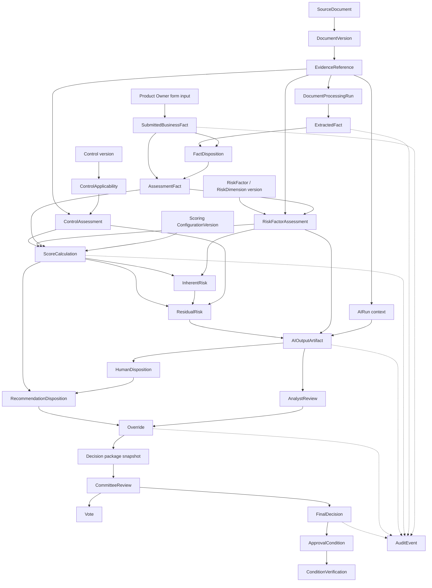

# FULCRUM evidence and decision lineage model

Status: Step 6.2 conceptual lineage model. This document defines how a material conclusion is reconstructed across source evidence, facts, calculation, AI assistance, human review, and committee decision. It does not define physical tables, indexes, migrations, or ORM mappings.

The lineage rule is simple: every material conclusion points to a versioned assessment snapshot and to the specific inputs used at that snapshot. Current documents, current policy, current scoring configuration, or current AI prompts must never be substituted when replaying historical meaning.

## 1. Lineage model

The primary lineage entities are. Jira is the normal source for initiative attachments and collaboration; FULCRUM owns the evidence reference and its use in an FCRM assessment.

| Lineage element | Required relationship | Historical rule |
|---|---|---|
| `SourceDocument` / `DocumentVersion` | Identifies a Jira attachment or approved source and exact external version/timestamp | Jira remains authoritative; FULCRUM stores a hash or bounded snapshot when finalized replay requires it |
| `EvidenceReference` | Points to a Jira issue/attachment/comment, direct form input, or approved policy citation and locator | Must include source system, stable ID, source version/timestamp, and locator |
| `SubmittedBusinessFact` | Preserves the Product Owner’s original submitted value | Never replaced by extraction or correction |
| `ExtractedFact` | Preserves an AI/document-processing interpretation and its `AIRun`/processing run | Corrections create dispositions, not updates |
| `FactDisposition` | Records accepted, corrected, rejected, or superseded action | Actor, reason, timestamp, and replacement are retained |
| `AssessmentFact` | Version-scoped accepted input used by risk assessment/scoring | The authoritative input for that AssessmentVersion |
| `RiskFactorAssessment` | Links a factor assessment to accepted facts and evidence | No material factor without supporting references or explicit `UNKNOWN` |
| `InherentRisk` | Stores pre-control result and calculation reference | Calculation input snapshot is retained |
| `ControlAssessment` | Links applicable controls and effectiveness to evidence | Effectiveness cannot be inferred from control existence alone |
| `ResidualRisk` | Stores inherent-risk reference, control inputs, calculation, and result | Controls mitigate; they do not erase inherent risk |
| `AIRun` / `AIOutputArtifact` | Stores bounded AI execution and proposed output | Output remains a proposal until human disposition |
| `AnalystReview` / `Override` | Stores analyst validation, recommendation, or difference from AI/system output | Original values remain visible |
| `CommitteeReview` / `Vote` / `FinalDecision` | Stores package version, votes, and authoritative outcome separately | Final decision is not derived from an AI output or a single unbound vote |
| `AuditEvent` | Connects commands and material actions by entity/version/correlation IDs | Append-only and replayable |

`EvidenceReference` is a typed, reusable source pointer—not a generic graph database abstraction. It should identify `sourceType`, `sourceId`, `sourceVersion`, `locator`, and optional `contentHash`. Domain relationships remain explicit (`RiskFactorAssessment.evidenceRefs`, `ScoreCalculation.inputRefs`, `AIContextReference.sourceRefs`, and so on).

## 2. Lineage diagram



## 3. Provenance rules

### Creation

1. A direct Product Owner value creates a `SubmittedBusinessFact` and an immutable submission/audit event.
2. A document upload creates a `SourceDocument` reference and immutable `DocumentVersion` identified by checksum.
3. Extraction creates a `DocumentProcessingRun` and immutable `ExtractedFact` records linked to exact document versions and source locators.
4. A human-approved value creates an `AssessmentFact` for one `AssessmentVersion`; it points to the original submission, extraction, correction, or governed source.
5. Every risk, control, score, AI artifact, review, override, and decision is created with its `initiativeId` and `assessmentVersionId`.

### Correction

Corrections never update or delete a submitted or extracted value. A `FactDisposition` records the original value/reference, corrected value, actor, reason, supporting evidence, and timestamp. The corrected value becomes a new `AssessmentFact` or a new version-scoped fact representation.

### Supersession

Supersession means a newer version is authoritative for a newer assessment context. It does not invalidate the historical meaning of the prior record. A superseding record stores `supersedesId`/`previousVersionId` and the reason.

### Invalidation

An artifact is invalidated for future use when an upstream dependency changes, but the original artifact remains available for historical replay. Invalidation records the cause, affected dimensions, timestamp, and whether recalculation or analyst review is required.

### Historical preservation

Finalized AssessmentVersions resolve all referenced source, policy, taxonomy, control, scoring, AI, and decision versions directly. No replay operation follows a “latest” relationship. Missing historical source content is reported as unavailable; it is never silently replaced.

## 4. Version resolution rules

For a historical `AssessmentVersion`, resolve versions in this order:

| Artifact | Resolution rule |
|---|---|
| Source content | `EvidenceReference.sourceId + sourceVersion` → exact `DocumentVersion` or direct submission event |
| Extracted fact | `ExtractedFact.extractionRunId` plus source document/version; preserve service/model metadata |
| Accepted fact | `AssessmentFact.assessmentVersionId`; follow provenance to submitted/extracted/corrected origin |
| Risk taxonomy | `RiskFactorAssessment.riskFactorVersionId` and `riskDimensionVersionId` |
| Controls | `ControlApplicability.controlVersionId` and `ControlAssessment` version |
| Policy/regulatory source | `PolicyVersionId` plus `PolicySectionCitation`; never current policy by title alone |
| Scoring | `ScoreCalculation.configurationVersionId` plus serialized validated inputs and intermediate results |
| AI execution | `AIRun.provider`, deployment/model version, task contract, prompt/instruction version, context manifest, and output artifact |
| Analyst action | `AnalystReview`, `RecommendationDisposition`, `HumanDisposition`, and `Override` attached to the same AssessmentVersion |
| Committee package | Immutable package snapshot/hash attached to `CommitteeReview` and `FinalDecision` |
| Conditions | Conditions reference the originating `FinalDecision`; later verification is separate operational history |

The physical design should enforce that a finalized version cannot reference a mutable current configuration without a pinned version ID and content hash.

## 5. Examiner walkthrough: Golden Initiative sanctions conclusion

The synthetic conclusion is: **sanctions exposure is high, with conditional approval because partner diligence and monitoring evidence remain incomplete**.

1. Jira attachment `jiraAttachment-006` on the synthetic initiative represents the Partner Due Diligence Evidence Pack. FULCRUM `EvidenceReference EV-006` points to the Jira issue ID, attachment ID, source timestamp/hash, and Items 1–8 locator.
2. Document Intelligence processes the Jira attachment and produces a fact stating that beneficial-ownership evidence is pending. The `ExtractedFact` retains its Jira source identifiers/version, locator, extraction method, timestamp, and confidence.
3. Daniel Reyes accepts the fact into Assessment Version 1 as an `AssessmentFact`. The original extracted fact remains unchanged; the disposition records Daniel, rationale, and time.
4. `RF-SAN-01` links the accepted fact and evidence to the sanctions risk factor version, synthetic policy citations, and `CTL-002`/`CTL-004` control assessments.
5. The deterministic calculation references the complete validated factor/control input set and `FULCRUM-SYNTH-CONFIG-1.2`. It stores intermediate inherent score, control mitigation, residual score 78, threshold lookup, and residual rating `HIGH`.
6. `AIO-001` is an AI risk recommendation linked to its `AIRun`, source references `EV-006`/`EV-007`, prompt/task version, and context manifest. It recommends `HIGH`; it does not alter the score or workflow.
7. Daniel creates an override/disposition from AI/system context to an analyst recommendation of `MEDIUM`, retaining original value, final human value, reason, evidence, actor, timestamp, and downstream impact. The system residual score remains `HIGH`.
8. Helen Morgan reviews the immutable decision package for Assessment Version 1. Her vote and the separate `FinalDecision` record `APPROVED_WITH_CONDITIONS`. The conditions reference the decision and remain open until verified or waived.
9. Audit events connect each source, fact disposition, calculation, AI run, analyst review, override, vote, decision, and condition event by version and correlation ID.

## 6. Selective reassessment rules

Selective reassessment uses explicit dependency references rather than a universal dependency graph. Each versioned artifact records its upstream IDs and affected `RiskDimension` values.

Example:

```text
destination geography fact changed
→ MaterialChange recorded
→ GEOGRAPHIC risk dimension invalidated
→ geography-linked policy citations reviewed
→ affected risk-factor assessments recalculated
→ applicable controls reviewed
→ inherent/residual calculations regenerated
→ linked AI observations marked stale
→ analyst review reopened for affected package
```

Unrelated dimensions remain valid only when their input and configuration dependencies are unchanged. A conservative fallback is to invalidate the full calculation when dependency metadata is incomplete. A new `AssessmentVersion(parentVersionId)` is required for material changes; finalized history is never edited.

## 7. Query requirements for physical design

The physical model must support efficient queries for:

- Why did this final residual rating occur?
- Which accepted facts and evidence support this risk factor?
- Which exact document version/page/section was used?
- Which controls mitigated this inherent risk and what evidence supports effectiveness?
- Which scoring configuration and input snapshot produced this score?
- Which assessments used scoring model/configuration `FULCRUM-SYNTH-CONFIG-1.2`?
- Which decisions relied on a particular policy version or citation?
- Which AI outputs were accepted, edited, rejected, or overridden?
- What did the analyst change, why, and what downstream artifacts were affected?
- What package/version did the committee review?
- Which votes produced the final decision?
- What conditions came from this decision and what is their verification history?
- What changed between Assessment Versions 1 and 2?
- Which artifacts are stale or invalidated because of a material change?
- Can the complete trace be reconstructed for an Initiative at a historical timestamp?

## 8. Complexity review

The hackathon should not implement a generic graph database, universal relationship table, full event sourcing, or a separate autonomous entity for every AI agent. Use explicit foreign-key-style IDs between the domain records, a typed `EvidenceReference`, versioned snapshots, and append-only audit events.

For the Golden Initiative, the minimum convincing implementation is:

```text
SourceDocument/DocumentVersion
→ EvidenceReference/ExtractedFact
→ AssessmentFact
→ RiskFactorAssessment
→ ScoreCalculation
→ AIOutputArtifact
→ HumanDisposition/Override
→ CommitteeReview/FinalDecision
→ ApprovalCondition
```

Policy citations, control assessments, timestamps, and audit references must be present in this slice. Embeddings, retrieval chunks, external regulatory synchronization, and full condition workflow can remain derived or later-phase infrastructure.

## Lineage Verdict

### READY WITH QUESTIONS

The lineage model is complete enough to guide physical design, but several decisions still affect keys, constraints, and snapshot boundaries.

## Blocking Gaps

1. Confirm that `AssessmentVersion` is the immutable replay boundary for all material facts, findings, calculations, AI artifacts, reviews, and decisions.
2. Confirm the required source snapshot/retention guarantee for document and policy citations.
3. Confirm whether every final score requires a complete calculation input snapshot or may reference immutable child records only.
4. Confirm the override rule and whether a human recommendation may differ from deterministic residual risk without recalculation.
5. Confirm the condition ownership relationship to `FinalDecision` and the closure/waiver audit requirements.

## Ready for 6.3?

### NO

The lineage shape is ready, but the five blocking questions above should be answered before physical schema design. Once resolved, Step 6.3 can translate these concepts into PostgreSQL tables, constraints, indexes, and migration strategy without reopening the domain model.
