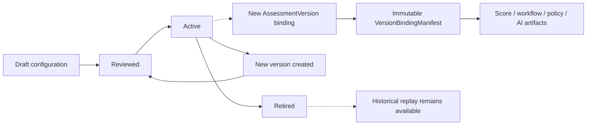
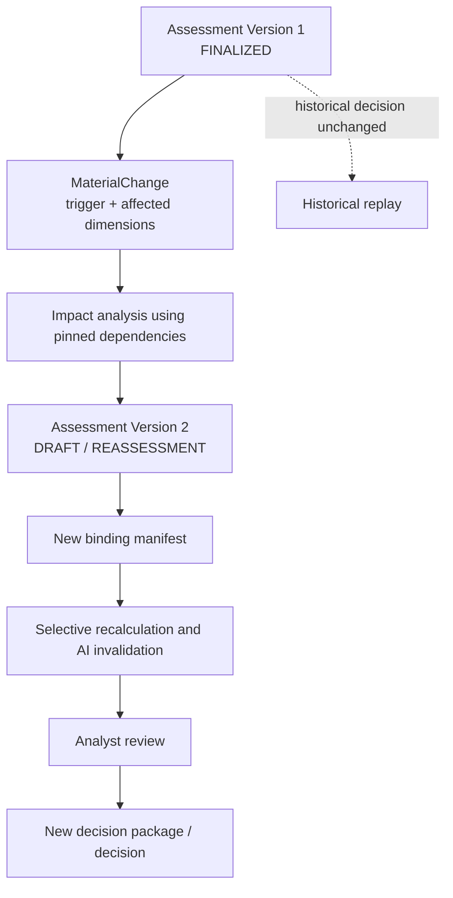

# FULCRUM versioning and configuration model

Status: Step 6.3 conceptual model. This document defines version identity, lifecycle, activation, effective dating, historical replay, and change impact before physical PostgreSQL design. It does not define tables, indexes, migrations, or ORM mappings.

## 1. Versioning strategy

FULCRUM uses immutable historical snapshots plus mutable current projections:

```text
Assessment
  └── AssessmentVersion 1 ── material change ──> AssessmentVersion 2
          │                                           │
          └── pinned VersionBindingManifest           └── new pinned manifest
```

An `AssessmentVersion` is the historical decision boundary. A finalized version is never rewritten. It retains or directly references the exact submitted/accepted facts, source document versions, taxonomy, control definitions/configuration, scoring configuration, policy citations, AI runs/instructions, analyst actions, committee package, decision, and conditions used for that version.

Configuration is versioned independently and bound explicitly to an AssessmentVersion. Historical replay follows the binding manifest, never the currently active configuration.

The model distinguishes three kinds of change:

1. **Draft edit:** an ordinary edit within an unfinalized version; optimistic revision and audit event required.
2. **Material change:** creates a new AssessmentVersion with `previousVersionId`, affected dimensions, and explicit invalidation/reassessment decisions.
3. **Configuration publication:** creates a new configuration version; it never edits an existing assessment or decision.

## 2. Assessment versioning

### Assessment identity

`Assessment` is the stable identity associated with an Initiative. It owns the current-version pointer, purpose/type, and version sequence. It does not contain the historical risk or decision values itself.

### AssessmentVersion

Each version has:

```text
assessmentVersionId
assessmentId
versionNumber
previousVersionId
status
createdAt / createdBy
finalizedAt / finalizedBy
materialChangeId where applicable
versionBindingManifestId
decisionPackageHash where applicable
revision / concurrency token
```

Recommended statuses:

```text
DRAFT → IN_REVIEW → DECISION_READY → COMMITTEE_REVIEW → FINALIZED
                                      ↘ SUPERSEDED / REASSESSMENT_REQUIRED
```

`DRAFT` is mutable through authorized commands. Every draft edit increments a revision and records an audit event. Once an assessment is submitted for analyst review, material facts and derived artifacts are changed through explicit commands. Once `FINALIZED`, all material child records are immutable.

### Creating a new version

A new version is required for a material change, including geography, customer segment, product capability, payment flow, vendor, major process, control removal/change, material evidence update, or a configuration impact requiring reassessment. The new version starts from a snapshot/reference to the prior version, then receives new facts and recalculated artifacts.

The prior version remains queryable and retains its original decision. `previousVersionId` and `materialChangeId` make reassessment lineage explicit. The `Assessment.currentVersionId` pointer is mutable and identifies the latest operational version; it is not used for historical replay.

## 3. Versioned configuration catalogue

| Configuration/entity | Version key | Lifecycle | Activation behavior | Historical behavior |
|---|---|---|---|---|
| `ScoringModelVersion` | `scoringModelId + version` and content hash | Draft → Reviewed → Active → Retired | Explicit activation by authorized FCRM configuration owner; one active version per scope/effective period | Assessment binds exact version and input snapshot; later models do not rewrite scores |
| `RiskParameterVersion` | `parameterSetId + version` | Draft → Reviewed → Active → Retired | Published with scoring model dependency and thresholds | Bound by `ScoreCalculation`; old mappings remain valid for replay |
| `RiskDimensionVersion` / `RiskFactorVersion` | taxonomy ID + version | Draft → Reviewed → Active → Retired | New factor definitions apply only to newly bound/reassessed versions | Historical factor semantics remain pinned |
| `ControlDefinitionVersion` | control ID + version | Draft → Reviewed → Active → Retired | New objective/scope/owner definition is explicitly published | Historical control meaning remains pinned |
| `ControlEvaluationConfigurationVersion` | control evaluation set + version | Draft → Reviewed → Active → Retired | Defines effectiveness mappings/mitigation treatment for future bindings | Historical control calculation uses the pinned version |
| `PolicyVersion` / `GuidanceVersion` | document ID + version | Draft → Reviewed → Active → Retired | Effective content is immutable after activation | Historical citations point to exact content/version/locator |
| `WorkflowConfigurationVersion` | workflow/config scope + version | Draft → Reviewed → Active → Retired | Explicitly activates transition/precondition/readiness rules | Historical transitions retain the configuration version used |
| `MaterialChangeRuleVersion` | rule set + version | Draft → Reviewed → Active → Retired | Determines future impact analysis; AI cannot activate it | Historical materiality decisions retain their rule version |
| `AITaskContractVersion` | task type + contract version | Draft → Reviewed → Active → Retired | Selectable by AI Gateway route | Each `AIRun` pins task/instruction version |
| `PromptInstructionVersion` | task/prompt ID + version and hash | Draft → Reviewed → Active → Retired | Active route selects it for new runs | Historical AI runs retain exact instruction reference and context manifest |
| `RetrievalConfigurationVersion` | collection/strategy + version | Draft → Reviewed → Active → Retired | Controls corpus, filters, ranking, and retrieval limits | Each material AI run retains retrieval configuration and selected references |
| `CommitteeGovernanceConfigurationVersion` | governance scope + version | Draft → Reviewed → Active → Retired | Defines quorum/vote rules for future reviews | Committee review pins the rule used |

For the hackathon, these can be represented by one governed `ConfigurationVersion` envelope with a `configurationType`, version, content hash, dependencies, and effective dates. The conceptual distinctions remain visible even if the first physical implementation uses a small number of configuration documents.

## 4. Assessment version binding manifest

Every AssessmentVersion has one immutable binding manifest containing the exact configuration and source versions used:

```text
VersionBindingManifest
├── scoringModelVersionId
├── riskParameterVersionId
├── riskTaxonomyVersionId
├── controlDefinitionVersionIds[]
├── controlEvaluationConfigurationVersionId
├── workflowConfigurationVersionId
├── materialChangeRuleVersionId
├── policyVersionIds[] / policy citation IDs
├── sourceDocumentVersionIds[]
├── acceptedFact IDs and provenance references
├── retrievalConfigurationVersionIds where applicable
└── bindingCreatedAt / bindingCreatedBy / contentHash
```

AI instruction/model versions are pinned per `AIRun`, because different tasks within one assessment may use different routes. The manifest records the relevant run IDs; it does not pretend that one model version describes every AI artifact.

## 5. Configuration lifecycle and binding



Activation is explicit and records actor, timestamp, rationale, predecessor, scope, effective dates, dependencies, and content hash. Activation does not mutate any previously bound assessment.

## 6. Assessment versioning and material change



AI may propose `material=true` or identify a possibly affected dimension. A deterministic material-change rule and authorized FCRM review decide whether a new version is required.

## 7. Material-change rules

| Change | Default impact | Version action |
|---|---|---|
| Geography/corridor | Geographic, sanctions, transaction, policy, and related controls | New version; selective reassessment if dependencies are complete |
| Customer segment/eligibility | Customer, fraud, transaction, and onboarding controls | New version |
| New product capability | Product/service, channel, transaction, and controls | New version |
| Payment-flow change | Transaction, geography, channel, vendor, controls | New version |
| Vendor/partner change | Third-party, sanctions, geography, controls | New version |
| Major process/control change | Control, residual score, affected risk dimensions | New version |
| New evidence with no material fact change | Evidence-only update may remain in draft; analyst decides if finalized assessment is affected | New version if decision meaning or score can change |
| Typo/UI metadata change | No assessment version if it cannot affect meaning, score, authority, or evidence | Draft revision and audit only |
| New policy/scoring/taxonomy configuration | Existing assessments remain historical; impact analysis identifies candidates | Optional or mandatory reassessment according to configuration/policy |

## 8. Effective-dating and resolution rules

Configuration versions support:

```text
effectiveFrom
effectiveTo (nullable)
status: DRAFT | REVIEWED | ACTIVE | RETIRED
scope
predecessorVersionId
contentHash
```

Rules:

1. A new draft cannot be used for an assessment.
2. An AssessmentVersion binds the active configuration versions resolved for its effective date and scope at binding time.
3. Overlapping active periods for the same configuration type/scope are rejected, except where an explicit priority rule is approved.
4. `effectiveTo` is exclusive; a successor may begin at the same instant.
5. Retiring a configuration prevents new bindings but does not remove historical access.
6. Historical replay resolves the binding manifest directly, not `status=ACTIVE` and not “latest by version.”
7. If an active configuration is withdrawn for safety, existing bindings remain intact and impact analysis determines whether reassessment is required.
8. Policy/regulatory citations must also resolve a source content version and locator; title-only or current-document lookup is invalid.

## 9. Historical reproduction walkthrough

For Golden Initiative Assessment Version 1:

```text
AssessmentVersion FA-2026-00124:v1
├── scoring: FULCRUM-SYNTH-CONFIG-1.2 / FULCRUM-DEMO-SCORING-1.0
├── taxonomy: synthetic risk taxonomy version 1.0
├── controls: CTL-001..CTL-005 definitions/evaluation version 1.0
├── policies: POL-001/POL-002 exact synthetic content versions
├── source: EV-006 → DOC-006 version 1, Items 1–8
├── accepted facts: version-1 fact set and analyst dispositions
├── AI: AIO-001/AIO-002 with AIRun/task/instruction/context references
├── analyst: Daniel Reyes recommendation and override OVR-001
└── committee: Helen Morgan package/vote/final decision
```

To explain or recompute the historical residual risk, FULCRUM loads the version binding manifest, exact source/evidence references, accepted fact set, taxonomy/factor versions, control/effectiveness configuration, and scoring model. It recomputes the deterministic calculation and compares it with the persisted `ScoreCalculation` output and content hash. A mismatch is a replay-integrity error, not permission to substitute current configuration.

AI output is historically explainable through the persisted `AIRun`, provider/deployment, model version, task contract, instruction version, retrieval configuration, context references, output artifact, and human disposition. Exact byte-for-byte regeneration is not assumed unless the provider/runtime guarantees it; the authoritative historical AI artifact and inputs are retained.

## 10. Configuration change impact model

Configuration publication never mutates historical decisions:

```text
Scoring Model v1.3 activated
→ find AssessmentVersions bound to v1.2 in affected scope
→ compare v1.3 dependencies and material-change rules
→ create ImpactAnalysisResult per candidate
→ Analyst reviews optional/mandatory reassessment
→ if required, create AssessmentVersion(parentVersionId)
→ bind v1.3 and recalculate
→ preserve v1.2 result and decision
```

The same pattern applies to policy, taxonomy, control, workflow, and AI instruction changes. A policy publication may mark assessments for review; it must not rewrite their historical citations. An AI instruction change invalidates future AI artifacts or marks affected rationale stale; it does not alter the committee decision already recorded.

Impact results should capture `configurationVersionId`, candidate assessment/version IDs, affected dimensions, reason, detection method, severity, recommended action, reviewer, and status. Unknown dependency impact defaults to conservative analyst review rather than silent continuation.

## 11. Optimistic concurrency

Mutable operational records carry a revision/concurrency token. Commands include the expected revision and idempotency key. A stale revision is rejected with no mutation; a duplicate idempotency key returns the prior command result. Finalized versions and immutable configuration cannot be updated at all. `updatedAt` may support the physical implementation, but a monotonic revision is the conceptual contract.

## 12. Mutability matrix

| Record | Classification | Rule |
|---|---|---|
| Current Initiative projection | Mutable operational | Updated through authorized commands; history via events |
| Draft AssessmentVersion | Mutable operational with revision | Edits audited; no silent overwrite |
| Finalized AssessmentVersion | Versioned and immutable | New material change creates a successor |
| Assessment current-version pointer | Mutable projection | Never used for historical replay |
| SourceDocument metadata | Mutable operational | DocumentVersion content remains immutable |
| DocumentVersion/EvidenceReference | Immutable/versioned | New content creates a new version/reference |
| SubmittedBusinessFact/ExtractedFact | Immutable source/output | Disposition or successor records corrections |
| AssessmentFact/RiskFactorAssessment/ControlAssessment | Versioned | Belongs to an AssessmentVersion |
| ScoreCalculation/InherentRisk/ResidualRisk | Immutable calculation result | New inputs/configuration create a new result |
| Risk taxonomy/control/configuration versions | Versioned, immutable after activation | Draft can change before activation only |
| Policy/Regulatory version/citation | Versioned, immutable once effective | New publication does not rewrite old citations |
| AIRun/AIOutputArtifact/AIContextReference | Immutable | New run creates a new artifact |
| AnalystReview/Recommendation/Override | Versioned or immutable action | Corrections use compensating records |
| CommitteeReview/Vote/FinalDecision | Versioned/immutable after finalization | New decision requires reassessment version |
| ApprovalCondition current status | Mutable operational | Every change emits immutable history |
| Condition evidence/verification/waiver | Immutable records | New submission or decision creates a new record |
| JiraIssueLink sync status | Mutable projection | Sync history and external timestamps preserved |
| AuditEvent | Append-only immutable | No update/delete flow |

## 13. Hackathon simplification

Implement only the versioning behavior needed to prove historical meaning:

- one Golden Initiative `AssessmentVersion` with visible configuration ID/hash;
- one editable draft path with a revision check;
- one material-change example that creates Version 2;
- one active/retired scoring configuration representation;
- persisted or fixture-backed calculation inputs and outputs;
- visible audit event for activation and reassessment;
- exact evidence/policy/source references in the binding manifest.

Defer a full configuration-management portal, multi-tenant effective-date scheduler, automated impact-analysis service, generic dependency graph, configurable quorum engine, and provider-specific AI replay guarantees to production evolution.

## Versioning Verdict

### READY WITH QUESTIONS

The versioning strategy is coherent and provides a safe boundary for physical schema design. A small number of governance decisions still affect constraints and configuration scope.

## Blocking Gaps

1. Confirm the exact immutable AssessmentVersion boundary and finalization point.
2. Confirm whether the physical model uses one configuration envelope or separate version tables for scoring, taxonomy, controls, workflow, and AI instructions.
3. Confirm the policy for analyst values that differ from deterministic residual risk.
4. Confirm effective-date scope and whether overlapping active versions are always prohibited.
5. Confirm optional versus mandatory reassessment treatment for configuration changes.

## Ready for 6.4?

### YES, CONDITIONALLY

Proceed to Step 6.4 after recording the five decisions above. The physical schema can otherwise be derived from the immutable version boundary, binding manifest, effective-dated configuration lifecycle, and optimistic concurrency contract defined here.

