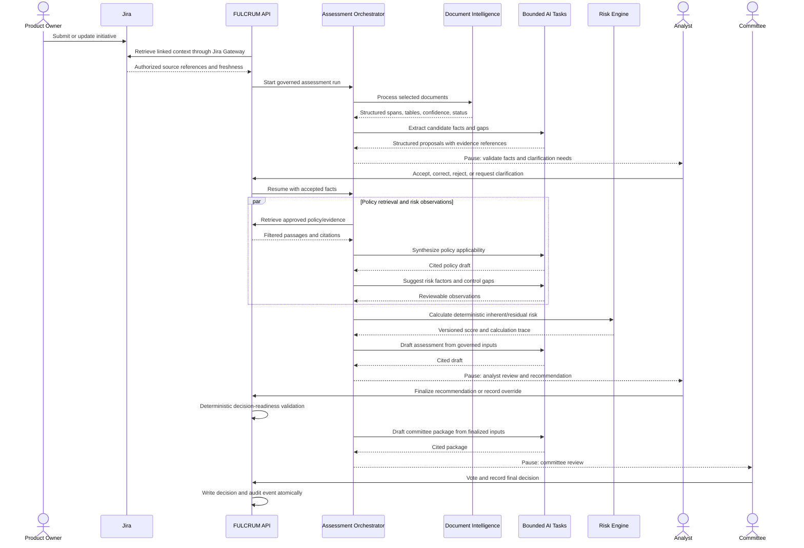

# FULCRUM agent and orchestration design

Status: **Step 7.2 — resolved for implementation design**.

FULCRUM uses a deterministic application-level `AssessmentOrchestrator` to coordinate bounded AI tasks. It manages dependencies, context, validation, retries, provenance, and pauses at human gates. It does not approve, reject, vote, change authoritative scores, activate configuration, or finalize workflow state.

The design intentionally has **zero required autonomous agents** for the hackathon. The initial capabilities are typed AI tasks behind one bounded coordinator; autonomous agents are reserved for cases where decomposition, iterative reasoning, or multi-tool planning demonstrably adds value.

## Orchestration architecture

```text
User command / domain event
        │
        ▼
AssessmentOrchestrator (deterministic coordinator)
        ├── context resolver and authorization
        ├── dependency/state checks
        ├── bounded AI task invocation
        ├── schema/citation validation
        ├── retry/failure policy
        ├── AI provenance and execution state
        └── human-gate pause/resume
                │
                ├── Jira Gateway
                ├── Document Processing Service
                ├── Knowledge Retrieval Service
                ├── Risk Engine
                ├── Workflow Engine
                └── Audit Service
```

The orchestrator coordinates these services but does not replace them. The web/API layer remains compatible with the current Next.js/Vercel deployment. A durable job runner can replace the in-process coordinator for long-running production work without changing task contracts.

## Component inventory

| Component | Type | Purpose | Tools | Input context | Output | Human gate | Why this type? |
|---|---|---|---|---|---|---|---|
| AssessmentOrchestrator | DETERMINISTIC_SERVICE | Coordinate tasks, dependencies, retries, pause/resume, and provenance | Service interfaces only | Assessment/version IDs and command metadata | Execution/task state and artifact references | Stops at every mandatory gate | Coordination and policy must be deterministic |
| Jira Gateway | DETERMINISTIC_SERVICE | Retrieve explicitly linked, authorized Jira context | Linked issue/attachment/comment reads | Jira IDs, user connection, scope | Versioned source references and freshness | Analyst confirms relevance when material | OAuth, access, and source identity are not model decisions |
| Document Processing Service | DETERMINISTIC_SERVICE | Validate files and invoke Document Intelligence for structure | Document processing adapter | Approved document reference | Document version, spans, tables, confidence, status | Review low-confidence results | Parsing and evidence anchoring need stable metadata |
| Evidence Interpreter | AI_TASK | Propose facts, gaps, contradictions, and source spans | Read evidence context | Selected Jira/document evidence and schema | Candidate facts/gaps with citations/confidence | Mandatory fact acceptance | One bounded structured interpretation is sufficient |
| Knowledge Retrieval Service | DETERMINISTIC_SERVICE | Search approved, versioned policy/evidence corpus | Search and citation lookup | Query, scope, jurisdiction, effective date | Ranked passages and citations | Analyst validates applicability | Retrieval filtering and citation identity must be exact |
| Policy Synthesis | AI_TASK | Summarize retrieved policy with uncertainty | Retrieval results only | Approved passages and question | Cited applicability draft | Mandatory for material policy use | Synthesis is bounded; retrieval remains separate |
| Risk Analysis Assistant | AI_TASK | Suggest risk factors, drivers, inconsistencies, and attention points | Read governed data | Accepted facts, taxonomy, score, controls, citations | Structured observations | Mandatory analyst review | It has no need for autonomous writes or planning |
| Risk Engine | DETERMINISTIC_SERVICE | Calculate inherent, mitigation, residual score, and bands | None | Accepted inputs and pinned configuration | Immutable calculation | Analyst reviews inputs | Reproducibility requires deterministic logic |
| Control Assessment Assistant | AI_TASK | Suggest control mappings and evidence gaps | Read controls/evidence | Facts, controls, and evidence | Suggested mapping/rationale | Mandatory control review | Semantic mapping benefits from AI but remains advisory |
| Assessment Drafting | AI_TASK | Draft analyst-facing assessment narrative | Read governed artifacts | Accepted facts, scores, controls, citations | Draft artifact with references | Mandatory analyst edit/finalize | Structured generation does not require an agent |
| Change Impact Assistant | AI_TASK | Summarize semantic differences between versions | Read version data | Changed facts/evidence and deterministic impact result | Change summary and suggestions | Analyst confirms materiality | Deterministic dependency rules remain authoritative |
| Committee Package | AI_TASK | Draft package from finalized assessment inputs | Read-only governed tools | Finalized version, score, overrides, conditions, citations | Draft package | Committee reviews | No action planning or decision authority |
| Conversational Assistant | AI_TASK | Answer permission-aware initiative questions | Bounded read tools/retrieval | Intent-specific context package | Grounded answer with labels/citations | No mutation path | Reuses bounded tools rather than becoming unrestricted |
| Workflow Engine | DETERMINISTIC_SERVICE | Enforce state, actor, preconditions, and gates | Transition command | Current state, actor, expected revision | Transition and event | Human command required | Authority cannot be delegated to AI |
| Audit Service | DETERMINISTIC_SERVICE | Write append-only material events | Audit command | Validated domain action | Audit event | None; human reviews later | Audit must reflect actual actions |
| Analyst / Committee | HUMAN_GATE | Accept facts, review findings, override, vote, and decide | Normal application commands | Governed package and cited evidence | Human dispositions and decision | Mandatory | Consequential FCRM authority is human |

## Agent reduction analysis

| Candidate | Decision | Reason |
|---|---|---|
| Evidence Interpreter Agent | Simplify to AI task | One structured call is easier to validate and replay |
| Policy Research Agent | Split into retrieval service plus synthesis task | Citation identity and filtering remain deterministic |
| Risk Analysis Agent | Simplify to AI task | It proposes observations but does not need autonomous planning |
| Assessment Agent | Simplify to drafting task | Drafting from known inputs does not justify a tool-using agent |
| Challenge Agent | Defer | Useful later; basic contradiction detection and analyst review suffice initially |
| Change Impact Agent | Simplify to AI task | Deterministic affected-dimension rules lead |
| Action Planner Agent | Defer | Write proposals add risk without strengthening the core demo |
| Jira Agent | Reject for hackathon | Jira write-back expands permissions and failure modes |
| Multi-agent swarm | Reject | No need for shared memory, delegation, or iterative negotiation |

## End-to-end sequence



## Context boundaries and permissions

| Component | Allowed context | Prohibited/unnecessary context | Tools |
|---|---|---|---|
| Evidence Interpreter | Selected Jira fields/comments, document spans/tables, output schema | Votes, audit history, raw tokens, unrelated issues/policies | Read linked evidence |
| Policy Synthesis | Approved retrieved passages and relevant accepted facts | Entire policy corpus, uncited model memory, OAuth data | Retrieval result only |
| Risk Analysis Assistant | Accepted facts, taxonomy, score, relevant controls/evidence/policy | Unaccepted AI facts, unrelated versions, secrets | Read governed assessment |
| Assessment Drafting | Accepted facts, calculations, controls, citations, reviewed observations | Raw unreviewed corpus, hidden reasoning, unrelated initiatives | Read-only governed tools |
| Change Impact Assistant | Prior/current diffs and deterministic affected dimensions | Current-config substitution, unrelated assessments | Read version comparison |
| Committee Package | Finalized version, analyst recommendation/override, open conditions, citations | Draft facts, private notes outside package, mutation tools | Read-only package tools |
| Conversational Assistant | Intent-specific authorized context and citations | Whole database, account-wide Jira search, secrets, unrestricted memory | Bounded read tools only |

Every task receives an assessment/version ID, context manifest, source references, task-contract version, and output schema. The model never receives OAuth tokens or direct database access.

## Structured task contract

Every material task uses an envelope containing:

```text
taskRunId, assessmentId, assessmentVersionId, taskType,
taskContractVersion, inputReferences[], contextManifest,
expectedOutputSchema, provider/deployment metadata, retryCount,
status, outputArtifactId, validationResult
```

Outputs must be schema-valid, source-referenced, uncertainty-aware, and explicitly marked as proposed. Missing citations or invalid source IDs make an artifact unusable for downstream material tasks.

## Failure and retry matrix

| Failure | Retry | Fallback | Human intervention |
|---|---|---|---|
| Transient model/network error | Bounded exponential retry, maximum 2–3 | Mark failed and use manual path | Required if material output is unavailable |
| Invalid structured output | One repair attempt with same bounded context | Discard invalid artifact | Analyst uses manual/template path |
| Missing or hallucinated citation | Do not consume downstream; optional constrained retry | Return `UNKNOWN` and source records | Analyst resolves evidence gap |
| Low confidence/weak retrieval | Narrow query or deterministic filters | Show passages without synthesis | Analyst validates applicability |
| Jira timeout/401/403/rate limit | Retry safe reads only | Use governed snapshot or mark stale | Analyst decides whether to continue |
| Document Intelligence failure | Bounded service retry | Manual review or evidence gap | Required for material document facts |
| Context/token limit | Reduce to task-specific context | Smaller task or manual review | Required if context remains insufficient |
| Conflicting evidence | No auto-resolution | Create clarification/review item | Analyst decides accepted fact |
| Repeated tool failure | Stop execution; no uncontrolled loop | Preserve partial state | Operator/analyst resumes or restarts |
| Database/audit failure | Transaction rollback and idempotent retry | No consequential completion | Operator investigates if persistent |

## Execution state and selective reprocessing

Minimum execution records are `OrchestrationRun` and `OrchestrationTask` with IDs, assessment/version, task type, status, dependencies, retry count, input/output references, timestamps, validation result, correlation ID, and failure code.

Task states are:

```text
PENDING → READY → RUNNING → VALIDATING → COMPLETED
                         ├→ WAITING_FOR_HUMAN
                         ├→ RETRYABLE_FAILURE → READY
                         └→ FAILED / CANCELLED
```

`WAITING_FOR_HUMAN` stops the current attempt. A human command creates a resumable transition; the model does not continue autonomously.

For a geography change, deterministic material-change rules identify geography/sanctions/transaction impacts, create an assessment successor, and invalidate only affected policy synthesis, risk observations, control suggestions, and drafts. Unrelated customer or product artifacts remain valid when their inputs are unchanged. The orchestrator records invalidated artifact IDs and recalculates only the affected package.

## Conversational orchestration

```text
user question
→ session/RBAC and initiative scope
→ intent classification
→ bounded read-tool selection
→ tool authorization and retrieval
→ grounded response with labels/citations
→ AI run and audit telemetry
```

The chatbot has no direct mutation route. Future action proposals must call normal application commands, which independently validate authorization, workflow, revision, idempotency, and audit requirements.

## Hackathon versus production

### Hackathon implementation

- one application-level orchestrator;
- synchronous bounded tasks for the Golden Initiative;
- fixture-backed execution state where persistence is unavailable;
- fake provider and optional provider adapter;
- read-only tools;
- explicit human pauses in the demo;
- visible task status, citations, provenance, and token metadata.

### Production evolution

- durable orchestration task records in PostgreSQL;
- queue/worker execution for Document Intelligence, embeddings, Jira reconciliation, and long jobs;
- external retry/dead-letter handling;
- Azure AI Foundry routing and evaluation gates;
- durable conversation/task state;
- distributed locking and operational idempotency;
- approved archival and enterprise observability.

Kafka, Temporal, Kubernetes, and a multi-agent runtime are not required for the hackathon.

## Demo orchestration path

1. Retrieve the Golden Initiative and linked Jira context.
2. Ask why the residual score is HIGH; show deterministic calculation and evidence citations.
3. Ask what information is missing; show the bounded gap response.
4. Show AI recommendation `HIGH` and Daniel Reyes's explicit override to `MEDIUM`.
5. Generate a committee summary from finalized governed records.
6. Ask whether AI can approve the initiative; show refusal and route to Helen Morgan's committee decision.
7. Show the conditional decision and complete trace.

## Verdict

**READY WITH CHANGES**

The orchestration boundary is ready for implementation design. The first implementation must remain bounded and read-oriented; durable asynchronous execution is production evolution.

### Required agents

None for the hackathon. `AssessmentOrchestrator` is a deterministic coordinator, not an autonomous decision agent.

### Bounded AI tasks

Evidence interpretation, gap detection, policy synthesis, risk-factor/control suggestions, assessment drafting, version-change explanation, committee-package drafting, and initiative-aware Q&A.

### Deterministic services

Jira Gateway, Document Processing, Knowledge Retrieval, Risk Engine, Workflow Engine, Audit Service, authorization, validation, idempotency, retry, and persistence services.

### Deferred complexity

Autonomous action planning, Jira write-back, multi-agent delegation, generic graph dependencies, distributed workflow platforms, automatic materiality decisions, and AI-generated authoritative audit events.

## Ready for 7.3?

**YES.** The system has a bounded orchestration boundary, explicit task types, context and tool permissions, human stops, retry behavior, selective reprocessing, and a feasible hackathon path.
