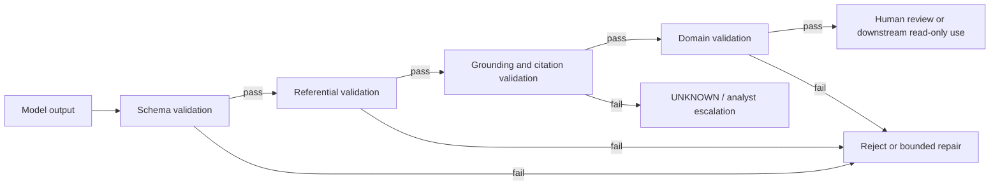

# FULCRUM agent and tool contracts

Status: **Step 7.4 — resolved for implementation design**.

These contracts define the boundary between the deterministic Assessment Orchestrator, bounded AI tasks, governed read tools, and human decisions. A syntactically valid model response is not trusted until it passes referential, grounding, domain, and authorization validation.

## Contract principles

- Every material task has a versioned input/output contract.
- Model-produced identifiers are untrusted and must be resolved against the allowed context.
- AI artifacts are proposed, never authoritative by default.
- Tools are allowlisted per task and enforce authorization again at execution time.
- No AI task receives Jira OAuth tokens, direct database access, arbitrary HTTP, or write authority.
- Hidden chain-of-thought is not stored; business-relevant rationale, evidence, uncertainty, and provenance are stored.
- Retries reuse idempotent execution identity and cannot create duplicate authoritative records.

## Shared execution envelope

```ts
type AIExecutionRequest = {
  taskId: string;
  orchestrationRunId: string;
  assessmentId: string;
  assessmentVersionId: string;
  actor: { id: string; role: string; scope: string[] };
  taskType: string;
  taskContractVersion: string;
  contextVersion: string;
  instructionVersion: string;
  inputReferences: Reference[];
  correlationId: string;
  idempotencyKey: string;
  requestedAt: string;
};

type AIExecutionResult<T> = {
  taskId: string;
  status: "COMPLETED" | "WAITING_FOR_HUMAN" | "FAILED" | "CANCELLED";
  structuredOutput: T | null;
  evidenceReferences: Reference[];
  citations: Citation[];
  warnings: string[];
  quality: QualitySignals;
  provenance: Provenance;
  validation: ValidationResult;
  completedAt?: string;
};

type Reference = {
  type: "ASSESSMENT" | "FACT" | "EVIDENCE" | "POLICY" | "CONTROL" | "RISK_FACTOR" | "JIRA" | "AI_ARTIFACT";
  id: string;
  version?: string;
  locator?: string;
};

type Citation = Reference & {
  sourceId: string;
  sourceVersionId?: string;
  locator: string;
  support: string;
};

type Provenance = {
  provider: string;
  deployment: string;
  modelVersion?: string;
  instructionVersion: string;
  contextManifestId: string;
  inputHash: string;
  outputHash?: string;
  inputTokens?: number;
  outputTokens?: number;
  latencyMs?: number;
};

type QualitySignals = {
  selfReportedConfidence?: number;
  citationCoverage?: number;
  schemaValid: boolean;
  groundingStatus: "PASS" | "PARTIAL" | "FAIL" | "NOT_APPLICABLE";
};

type ValidationResult = {
  status: "VALID" | "INVALID" | "ESCALATED";
  schema: "PASS" | "FAIL";
  references: "PASS" | "FAIL";
  grounding: "PASS" | "FAIL" | "NOT_APPLICABLE";
  domain: "PASS" | "FAIL" | "NOT_APPLICABLE";
  errors: string[];
};
```

`actor` identifies the requesting human, not the model. `idempotencyKey` is stable across safe retries. `inputHash` covers the exact context package and task configuration.

## AI contract catalogue

| Capability | Input contract | Output contract | Allowed tools | Validation | Human disposition |
|---|---|---|---|---|---|
| Evidence Interpreter | Selected Jira/document evidence, source refs, expected fact schema, assessment/version | Candidate facts, gaps, contradictions, source spans, confidence/uncertainty | `getJiraContext`, `retrieveEvidence` | Schema, source existence, evidence for material facts, no authoritative status | Analyst accepts/corrects/rejects facts |
| Policy Synthesis | Query, accepted relevant facts, retrieved approved passages/citations | Applicability summary, source IDs, citation IDs, uncertainty, unresolved questions | `searchPolicyKnowledge`, `getPolicySection` through retrieval boundary | Citation membership, approved source/version, no unsupported claim | Analyst validates material applicability |
| Risk Analysis | Accepted facts, taxonomy, deterministic scores, relevant controls, policy evidence | Suggested factors, drivers, gaps, inconsistencies, attention items, rationale draft | `getAcceptedFacts`, `getDeterministicRiskResults`, `retrieveEvidence` | Taxonomy IDs, evidence refs, no authoritative score fields | Analyst accepts/edits/rejects observations |
| Control Assessment | Accepted facts, control catalogue, evidence, risk context | Suggested controls, gaps, evidence summary, effectiveness rationale | `getAcceptedFacts`, `retrieveEvidence` | Control IDs and evidence refs must exist; no direct mitigation mutation | Analyst/control owner reviews |
| Assessment Draft | Accepted facts, deterministic results, reviewed controls, citations, reviewed observations | Structured narrative: summary, drivers, inherent/residual explanation, gaps, questions | Read-only governed tools | Claim-to-source/result coverage, version match, prohibited decision language | Analyst edits/finalizes |
| Change Impact | Prior/current version diff, changed facts/evidence, deterministic affected dimensions | Semantic change summary, suggested affected areas, invalidated narratives, uncertainty | `getVersionDiff`, `getAcceptedFacts` | Version identity and affected IDs; suggestions cannot invalidate records | Analyst confirms materiality |
| Committee Package | Finalized assessment version, calculation trace, analyst recommendation/override, citations, conditions | Structured decision package and unresolved issues | `getAssessmentContext`, `getDeterministicRiskResults`, `retrieveEvidence` | Finalized-version check, citation/source check, no outcome mutation | Committee reviews package |
| Conversational Assistant | Intent, authorized assessment scope, bounded tool results, recent-turn summary | Answer, labels, refs, assessment/version, limitations, suggested follow-up | Authorized read tools only | Tool-argument and reference validation, groundedness, refusal for decisions | User may act only through normal workflow |

Supported read intents are `GET_STATUS`, `EXPLAIN_RISK`, `SHOW_EVIDENCE`, `SHOW_POLICY`, `EXPLAIN_OVERRIDE`, `COMPARE_VERSIONS`, `SHOW_CONDITIONS`, and `SUMMARIZE_ASSESSMENT`. Mutation intents are not part of the first contract set.

## Bounded tool catalogue

| Tool | Purpose | Inputs | Outputs | Authorization | Side effects | AI access |
|---|---|---|---|---|---|---|
| `getAssessmentContext` | Return task-relevant assessment context | assessment/version, task, scope | Filtered context manifest and records | Assessment read plus task scope | None | Read |
| `getAcceptedFacts` | Return analyst-accepted facts | assessment version, fact IDs optional | Facts, provenance, dispositions | Evidence/assessment read | None | Read |
| `getDeterministicRiskResults` | Return authoritative score trace | assessment version | Inherent/residual results, inputs, config ref | Risk read | None | Read |
| `retrieveEvidence` | Resolve known evidence references | assessment version, evidence IDs | Source refs, locators, excerpts/hashes | Evidence read | None | Read |
| `searchPolicyKnowledge` | Bounded filtered retrieval | query, scope, filters, top-K | Ranked policy evidence/citations | Policy read and corpus scope | None | Read |
| `getPolicySection` | Retrieve exact policy content | policy/source version, citation | Section content and metadata | Policy read | None | Read |
| `getVersionDiff` | Compare two assessment versions | assessment/version IDs | Structured changed facts/evidence/artifacts | Assessment read; restricted historical access | None | Read |
| `getJiraContext` | Read explicitly linked Jira context | linked issue IDs, fields, comments, attachments | Permission-filtered source references and freshness | Jira linked-read scope | None | Read |
| `requestJiraAction` | Future proposal boundary only | action type, linked issue, reason | Non-authoritative proposal | Not enabled for hackathon | Normal Jira service later | Deferred |

No tool accepts raw SQL, arbitrary URLs, OAuth tokens, configuration activation, workflow transitions, votes, final decisions, or direct writes from AI.

## Permission matrix

| Capability | Assessment | Facts | Risk results | Evidence | Policy | Version diff | Jira | Writes |
|---|---:|---:|---:|---:|---:|---:|---:|---:|
| Evidence Interpreter | Read | No | No | Read | No | No | Read | None |
| Policy Synthesis | Scoped read | Relevant | No | Read | Read | No | No | None |
| Risk Analysis | Scoped read | Read | Read | Read | Read result | No | No | None |
| Control Assessment | Scoped read | Read | Optional | Read | Optional | No | No | None |
| Assessment Draft | Scoped read | Read | Read | Read | Read result | Optional | Optional | None |
| Change Impact | Read versions | Read both | Optional | Read | Optional | Read | Optional | None |
| Committee Package | Finalized read | Read | Read | Read | Read result | No | Scoped read | None |
| Conversational Assistant | Intent-scoped | Intent-scoped | Intent-scoped | Intent-scoped | Intent-scoped | Intent-scoped | Intent-scoped | None |

Tool authorization is checked before context construction and again at tool execution. Prompt text cannot grant access.

## Validation pipeline



Required checks include valid context IDs, source references, taxonomy/control IDs, assessment-version match, material claim support, and prohibition of authoritative score/decision fields. Invalid output never becomes downstream context.

## Error catalogue

| Error | Retry | Fallback |
|---|---|---|
| `INVALID_INPUT` | No | Return validation error |
| `UNAUTHORIZED_CONTEXT` | No | Deny and audit attempt |
| `RETRIEVAL_EMPTY` | Optional narrowed query once | `UNKNOWN`, analyst research |
| `CITATION_INVALID` | One constrained repair at most | Reject synthesis, show sources |
| `STRUCTURED_OUTPUT_INVALID` | One repair attempt | Discard artifact, template/manual path |
| `MODEL_UNAVAILABLE` / `MODEL_TIMEOUT` | Bounded transient retry | Manual path and preserved partial state |
| `TOOL_FAILURE` | Retry idempotent reads only | Stop dependent task |
| `CONTEXT_TOO_LARGE` | Rebuild smaller package | Smaller task or manual review |
| `STALE_VERSION` | No automatic overwrite | Reload and require user decision |
| `DUPLICATE_EXECUTION` | Return prior result | No duplicate artifact |
| `HUMAN_REVIEW_REQUIRED` | No model retry | Pause orchestration |
| `CONFLICTING_EVIDENCE` | No automatic resolution | Clarification/analyst review |

## Human disposition and provenance

```ts
type HumanDisposition = {
  id: string;
  aiArtifactId: string;
  assessmentVersionId: string;
  disposition: "ACCEPTED" | "EDITED" | "REJECTED" | "SUPERSEDED" | "NOT_REVIEWED";
  reviewerId: string;
  reviewerRole: "FCRM_ANALYST" | "RISK_COMMITTEE";
  rationale?: string;
  evidenceReferences: Reference[];
  resultingRecordId?: string;
  occurredAt: string;
};
```

The AI artifact is never overwritten. The disposition points to the resulting authoritative fact, recommendation, or review record.

## Evidence Interpreter walkthrough

```text
Jira attachment reference
→ Document Intelligence normalized spans
→ ContextBuilder selects source and fact schema
→ Evidence Interpreter returns candidate fact + source locator
→ schema/reference/grounding/domain validation
→ task pauses at human gate
→ analyst accepts, corrects, or rejects
→ AssessmentFact becomes authoritative for the version
→ deterministic scoring may consume it
```

An invented evidence ID fails referential validation. A fact without supporting evidence remains a proposal or becomes an explicit information gap.

## Contract test plan

Implement later:

- valid envelope and structured output;
- malformed JSON and missing required fields;
- invented evidence, policy, Jira, control, and risk-factor IDs;
- missing citation for a material claim;
- unauthorized tool and out-of-scope assessment;
- stale assessment-version request;
- retry after transient failure;
- duplicate task/idempotency key;
- invalid score or decision fields in AI output;
- human acceptance, edit, rejection, and override preservation;
- citation coverage, `UNKNOWN` behavior, and token/provenance recording.

## Hackathon scope and verdict

### Contracts required for the demo

Shared execution/result envelope, evidence/fact proposal, risk explanation/draft, conversational read-answer, bounded read-tool contracts, permission matrix, validation pipeline, standard errors, idempotency, human disposition, and provenance.

### Deferred contracts

Jira actions, autonomous planning, multi-agent handoffs, streaming tool choreography, provider-specific variants, and generic plugin protocols.

**Contract Verdict: READY WITH CHANGES**

The contracts are ready for implementation after selecting the first demo task set. The first runtime should implement only the shared envelope, bounded read tools, validation, and the highest-value task contracts.

## Ready for 7.5?

**YES.** The task/tool boundaries, permissions, validation, errors, provenance, human disposition, and test obligations are defined without creating a generic agent platform.
