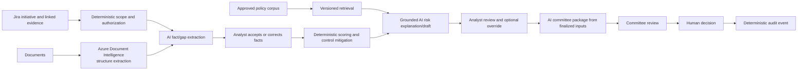

# FULCRUM AI capability map

Status: **Step 7.1 — resolved for orchestration design**.

FULCRUM uses AI where interpretation, summarization, semantic comparison, and grounded drafting are difficult to express reliably with rules. Deterministic services own validation, authorization, scoring, workflow, configuration activation, and audit. Humans own material FCRM judgments and committee decisions.

## Capability matrix

| Capability | Lifecycle stage | Classification | AI role | Deterministic role | Human role | Risk | Why AI? | Fallback |
|---|---|---|---|---|---|---|---|---|
| Required-field validation | Intake | DETERMINISTIC | None | Validate schema and required fields | Resolve exceptions | Low | Rules are exact and explainable | Manual form review |
| Initiative summary | Jira context | AI_ASSISTED | Summarize authorized Jira fields/comments | Select scope, permissions, freshness, citations | Correct or accept summary | Low | Compresses long context for reviewers | Show source Jira records |
| Missing-information detection | Intake | HYBRID | Suggest gaps and clarification questions | Check mandatory fields and known prerequisites | Approve questions and disposition gaps | Medium | Finds semantic gaps beyond field presence | Deterministic checklist |
| Jira change-characteristic extraction | Jira context | AI_ASSISTED | Identify likely geography, product, channel, customer, and vendor changes | Restrict issue scope and validate output schema | Accept/correct extracted facts | Medium | Interprets unstructured descriptions and comments | Manual fact entry |
| OCR/layout/table extraction | Documents | DETERMINISTIC / AI_ASSISTED | Document Intelligence extracts structure | File/type/malware checks and evidence anchoring | Review low-confidence extraction | Medium | Handles document layout and tables better than custom parsers | Manual upload/transcription |
| Semantic fact extraction | Documents/intake | AI_ASSISTED | Propose normalized facts with confidence and source spans | Validate schema and source references | Accept, correct, or reject | High | Converts varied prose into reviewable candidate facts | Analyst extracts manually |
| Policy retrieval | Knowledge | HYBRID | Generate/search queries and rank relevant passages | Filter approved corpus, jurisdiction, version, and permissions | Confirm applicability | High | Semantic search and query reformulation improve recall | Keyword search and analyst research |
| Policy synthesis | Knowledge/risk analysis | AI_ASSISTED | Summarize retrieved policy with citations and uncertainty | Require approved sources and citation coverage | Validate interpretation | High | Synthesizes multiple approved passages | Show retrieved passages only |
| Risk-factor identification | Risk analysis | AI_ASSISTED | Suggest applicable factors, contradictions, and overlooked concerns | Use governed taxonomy and applicability rules | Accept/correct factor applicability | High | Finds semantic relationships across facts and evidence | Present configured factor checklist |
| Risk scoring | Risk analysis | DETERMINISTIC | None | Calculate inherent, control, and residual risk using pinned configuration | Review inputs and recommendation | High | LLM output is not reproducible enough for scoring | Manual review of calculation |
| Control mapping | Control assessment | HYBRID | Suggest relevant controls and summarize control evidence/gaps | Resolve configured control applicability and mitigation mechanics | Accept/correct effectiveness assessment | High | Maps varied evidence to control objectives | Control-library checklist |
| Assessment draft | Assessment | AI_ASSISTED | Draft summary, drivers, evidence discussion, gaps, and rationale | Restrict to accepted facts and linked evidence | Edit and finalize | High | Produces coherent prose from governed records | Template-based draft |
| Analyst Copilot Q&A | Analyst review | AI_ASSISTED | Answer scoped questions and explain findings with citations | Authorize tools, assemble context, label facts/inferences | Challenge and decide whether to rely on answer | High | Natural-language navigation across related records | Direct read-only screens |
| Version comparison | Reassessment | HYBRID | Summarize semantic changes between versions | Determine known affected dimensions and invalidate artifacts | Confirm materiality and impact | High | Finds meaningful changes beyond field diffs | Structured field diff |
| Clarification drafting | Information gathering | AI_ASSISTED | Draft targeted questions from evidence gaps | Track required fields and workflow state | Analyst/owner approve and respond | Medium | Makes questions specific to the initiative | Standard question templates |
| Committee package | Committee review | AI_ASSISTED | Summarize governed facts, score, controls, overrides, and open conditions | Select finalized version and verify completeness/citations | Committee reviews package | High | Reduces review time without deciding outcome | Deterministic report |
| Committee decision | Committee review | HUMAN_DECISION | May answer grounded questions only | Enforce authority, quorum, state transition, and audit | Vote and finalize outcome | High | No AI role in consequential decision | Manual committee process |
| Audit event generation | Audit/operations | DETERMINISTIC | May summarize events after the fact | Emit immutable events from commands | Review audit trail | High | Audit authority must reflect actual actions | Application/database audit path |
| Operations summary | Audit/operations | AI_ASSISTED | Summarize non-authoritative operational trends | Preserve source metrics and access controls | Interpret and act | Medium | Explains patterns across event and run data | Dashboards and raw events |

## Non-AI list

The following must not be delegated to an LLM:

- required-field and schema validation;
- permission checks, tenant boundaries, and Jira scope enforcement;
- workflow transition authorization and preconditions;
- risk-factor weights, formulas, thresholds, and rating bands;
- inherent-risk, control-mitigation, and residual-risk calculations;
- configuration activation and effective-date enforcement;
- committee quorum and vote uniqueness rules;
- approval, rejection, deferral, condition waiver, or final decision;
- authoritative audit-event creation;
- idempotency, concurrency, retries, and transaction boundaries;
- evidence identity, source-version binding, and citation integrity.

These tasks require exactness, reproducibility, or authority that probabilistic generation cannot safely provide.

## Capability priority

| Priority | Capabilities | Scope |
|---|---|---|
| MUST DEMO | initiative summarization, missing-information suggestions, grounded risk explanation, evidence/citation display, analyst Copilot Q&A, committee summary, human decision refusal | One connected Golden Initiative flow |
| SHOULD DEMO | structured fact extraction fixture, risk-factor suggestions, control-gap suggestions, clarification drafting, visible AI provenance and token metadata | Add if reliable and measurable |
| ARCHITECTURE ONLY | Document Intelligence pipeline, policy retrieval architecture, version comparison, selective invalidation, Azure routing, evaluation harness | Contracts and diagrams, not necessarily live |
| DEFER | autonomous action planner, Jira write-back agent, generic multi-agent collaboration, automated regulatory conclusions, automatic materiality decisions, AI-generated audit events | Not justified for the hackathon |

## Recommended end-to-end demo flow

The demo should show one AI suggestion being overridden, while the deterministic score and original AI artifact remain visible.

## Human checkpoint map

| Output | Review requirement |
|---|---|
| Summary | Optional review; source links always visible |
| Missing-information suggestion | Analyst or Product Owner confirmation before formal clarification |
| Extracted fact | Mandatory acceptance/correction before scoring |
| Policy applicability | Mandatory analyst review for material conclusions |
| Risk-factor suggestion | Mandatory analyst review |
| Control mapping/effectiveness draft | Mandatory analyst/control-owner review |
| Assessment draft | Mandatory analyst editing/finalization |
| Risk score | Deterministic calculation plus analyst review of inputs |
| Committee package | Committee review; package cannot change authoritative records |
| Final decision | Human committee decision only |
| Audit record | Deterministic system output; no AI acceptance path |

No material FCRM conclusion has automatic acceptance. Automatic acceptance is limited to low-risk technical operations such as schema validation or processing-status updates.

## AI value justification

AI adds value when the input is unstructured, semantically varied, or spread across multiple authorized sources. It does not add value where a rule, calculation, constraint, or human authority already provides a more reliable answer. The initial implementation therefore uses one bounded orchestrator with typed read tools and reviewable artifacts instead of multiple autonomous agents.

## Capability-level risks

- **Hallucination:** the model may introduce unsupported facts or policy claims. Require citations, `UNKNOWN` behavior, structured output validation, and source-only context.
- **Evidence misattribution:** a correct statement may be linked to the wrong source. Validate every material source reference and show locators.
- **Prompt injection:** Jira comments and documents are untrusted content, not instructions. Keep tool permissions outside model control.
- **Over-trust:** polished drafts may appear authoritative. Label AI output and preserve analyst disposition visibly.
- **Stale context:** Jira or policy content may change. Record retrieval time, source version, freshness, and context manifest.
- **Token waste:** repeated full-assessment prompts increase cost and inconsistency. Use scoped tools, summaries, caching, and selective reassessment.
- **Excessive autonomy:** action tools could bypass governance. Keep the first assistant read-only and route all mutations through deterministic commands.

## Azure mapping

| Capability | Azure target |
|---|---|
| OCR, layout, tables, forms | Azure AI Document Intelligence |
| Extraction, summarization, drafting, comparison, chat | Azure AI Foundry model deployment through the AI Gateway |
| Semantic retrieval | Approved indexed policy/evidence store with Azure model embeddings/reranking where needed |
| Scoring, workflow, authorization, audit | FULCRUM application services and PostgreSQL, not Azure AI |

The provider abstraction remains useful for local fake/test providers. Azure AI Foundry is the primary production direction; current OpenAI-compatible demo support does not change the governance boundary.

## AI capability verdict

**READY WITH CHANGES**

The capability boundary is ready for Step 7.2 orchestration design after keeping the first implementation to a small, connected set of read-only, evidence-grounded capabilities. No new autonomous agents are required.

### Highest-value AI capabilities

1. Grounded analyst Q&A over the active assessment and linked Jira context.
2. Missing-information and contradiction detection.
3. Evidence-backed risk-factor explanation and assessment drafting.
4. Committee package generation from finalized governed inputs.
5. Visible provenance, citations, confidence, and human override handling.

### Remove or defer

- autonomous approval or rejection;
- Jira write-back agent;
- automatic risk scoring;
- automatic regulatory applicability decisions;
- generic multi-agent swarm;
- AI-generated audit events;
- automatic material-change decisions;
- full live document/retrieval platform if synthetic fixtures are sufficient for the demo.

## Blocking questions before Step 7.2

1. Which three or four capabilities are guaranteed in the judging demo: recommended default is grounded Q&A, missing-information detection, risk explanation/drafting, and committee summary.
2. Which approved synthetic policy corpus is available for retrieval evaluation?
3. Which AI artifacts are persisted for the demo versus returned ephemerally?

These are implementation-scope choices, not architecture blockers. The map is ready to proceed to orchestration design.

## Ready for 7.2?

**YES.** The AI boundary, human gates, deterministic responsibilities, Azure service mapping, and hackathon priority are sufficiently defined for Step 7.2. The next step should design bounded orchestration and contracts around these capabilities, without adding autonomous decision agents.
