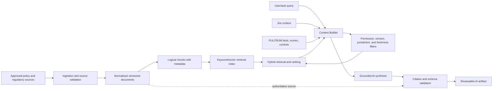

# FULCRUM context engineering and RAG design

Status: **Step 7.3 — resolved for implementation design**.

FULCRUM does not send the full Jira issue, every attachment, the entire policy corpus, all audit history, or every prior AI response to each model call. A deterministic `ContextBuilder` creates a task-specific, permission-checked, version-aware package. Retrieval is separate from generation, and source records remain authoritative over chunks, embeddings, summaries, and model output.

## Context source matrix

| Source | Authority | Used by | Versioning | Security scope | Cacheable? |
|---|---|---|---|---|---|
| Jira issue fields/description | Jira | Context summary, evidence interpretation, Q&A | Retrieved timestamp and source version/hash where available | User connection, tenant/project/issue permissions | Selected projection, permission-scoped |
| Jira comments | Jira | Gap detection, evidence interpretation, Q&A when linked/relevant | Comment ID, timestamp, source version | Explicit linked issue and user permission | Yes, short-lived and scoped |
| Jira attachment metadata/content | Jira | Document processing, evidence interpretation | Attachment ID/version/hash | Linked issue and attachment access | Extraction by content hash |
| FULCRUM assessment/version | FULCRUM | All assessment tasks as needed | Immutable version ID | Assessment assignment/RBAC | Yes by version and permission scope |
| Accepted assessment facts | FULCRUM | Risk analysis, drafting, Q&A, reassessment | Assessment version | Assessment authorization | Yes by version/content hash |
| Extracted facts | Derived | Fact review and provenance display | Extraction run/model/version | Same assessment/evidence scope | Yes by source hash/run |
| Risk taxonomy and controls | FULCRUM | Risk analysis and control mapping | Configuration version | Business-unit/assessment scope | Yes by configuration hash |
| Deterministic scores | FULCRUM | Risk explanation, drafting, committee package | Calculation/configuration version | Analyst/committee permissions | Yes by calculation ID |
| Overrides and analyst review | FULCRUM | Drafting, Q&A, committee package | Assessment version/action timestamp | Role and assessment scope | Yes after finalization |
| Committee data | FULCRUM | Committee package and authorized Q&A only | Review/package version | Committee membership | Restricted; do not expose to intake tasks |
| Policy/regulatory source | Approved source owner | Retrieval and policy synthesis | Source/policy version and effective dates | Corpus, jurisdiction, business scope | Indexed by source hash |
| Document Intelligence output | Derived | Evidence interpretation and citations | Document version, extraction/model version | Assessment/document scope | Yes by content hash |
| Prior AI outputs | FULCRUM-derived | Targeted comparison, disposition, Q&A when requested | AI run/task/output version | Same assessment and role scope | Yes by artifact ID; never blindly |
| Audit history | FULCRUM | Audit summary and version comparison when authorized | Event IDs and timestamps | Audit permission | Query selectively; no global cache |

## Task-specific context matrix

| Task | Required context | Optional context | Explicitly excluded | Size | Freshness rules |
|---|---|---|---|---|---|
| Evidence Interpreter | Selected Jira fields/comments, selected Document Intelligence spans/tables, assessment/version ID, output schema | Related evidence references | Votes, audit history, policy corpus, unrelated attachments | MEDIUM | Exact source version/hash required |
| Policy Retrieval/Research | User query, accepted facts relevant to query, jurisdiction/product/risk filters | Prior approved citation | Raw Jira history, committee data, model memory as authority | SMALL–MEDIUM | Active/effective policy versions only unless historical query |
| Risk Analysis | Accepted facts, risk taxonomy version, deterministic scores, relevant controls, cited evidence/policy | Reviewed AI observations | Candidate facts not accepted, secrets, unrelated versions | MEDIUM | Current assessment version and pinned configuration |
| Assessment Drafting | Accepted facts, finalized calculations, reviewed controls, citations, analyst dispositions | Approved AI observations, open questions | Raw OCR, full conversations, unreviewed candidate facts | MEDIUM | Same assessment version; refresh after material change |
| Change Impact | Prior/current accepted facts, structured diff, material-change results, affected dimensions | Targeted prior rationale | Complete prior transcript, unrelated initiatives, current config substitution | SMALL–MEDIUM | Both version IDs and binding manifests required |
| Committee Package | Finalized assessment version, score trace, analyst recommendation/override, citations, open conditions | Relevant Jira delivery summary | Draft facts, private analyst notes, raw source corpus, mutation tools | MEDIUM | Finalized package version only |
| Conversational Assistant | User intent, active initiative/assessment scope, minimum authorized tool results, citations | Recent-turn summary, requested prior-version diff | Whole database, account-wide Jira search, indefinite transcript, secrets | SMALL–MEDIUM | Fresh retrieval for material questions |

## Context Builder

The deterministic `ContextBuilder` performs this sequence:

1. Resolve the requested initiative, assessment, and assessment version.
2. Resolve actor identity, role, tenant/business scope, Jira connection, and permissions.
3. Identify the task contract and its allowed source classes.
4. Select only explicitly linked Jira issues, attachments, comments, and fields.
5. Resolve immutable FULCRUM facts, evidence, calculations, policies, and prior versions.
6. Apply freshness, effective-date, jurisdiction, product, and risk-dimension filters.
7. Deduplicate repeated evidence and prefer accepted structured facts over repeated raw source text.
8. Enforce context-size and top-K limits using deterministic truncation rules.
9. Serialize sources as labeled data, clearly marking untrusted Jira/document content.
10. Produce a context manifest containing every included, excluded, and truncated source.

The model does not independently query tables or decide what privileged context it should receive.

## Context contract

```json
{
  "task": "risk-explanation.v1",
  "assessmentId": "FA-2026-00124",
  "assessmentVersionId": "FA-2026-00124:v1",
  "actorContext": {"userId": "analyst-7", "role": "FCRM_ANALYST"},
  "acceptedFacts": [],
  "evidenceReferences": [],
  "deterministicResults": [],
  "retrievedPolicyEvidence": [],
  "priorVersionDiff": null,
  "contextVersion": "1.0",
  "generatedAt": "2026-09-03T00:00:00Z",
  "sourceVersions": [],
  "manifest": {"included": [], "excluded": [], "truncated": []},
  "sizeMetadata": {"estimatedTokens": 0, "deduplicatedItems": 0}
}
```

Fields are task-specific. Empty fields are omitted in actual packages rather than filled with irrelevant data.

## RAG architecture



### Ingestion

```text
source document
→ source/version/hash validation
→ normalization and structure detection
→ logical section/table/paragraph-group chunks
→ metadata and citation locators
→ keyword index and optional embeddings
```

### Retrieval

```text
task query
→ deterministic metadata filters
→ keyword/full-text and semantic candidates
→ optional reranking
→ top-K evidence set
```

### Generation

```text
retrieved evidence + task-specific FULCRUM context
→ grounded model synthesis
→ citation validation
→ proposed artifact with uncertainty
```

The original source/version is authoritative. Chunks, embeddings, rankings, and summaries are derived and may be regenerated.

## Knowledge-source governance

Every indexed source requires:

```text
sourceId, documentId, title, issuingAuthority, sourceType,
sourceVersion, effectiveFrom, effectiveTo, jurisdiction,
product/risk scope, section/page locator, ingestionTimestamp,
contentHash, approval/status, classification
```

Synthetic policy references remain clearly labeled as demo-only. The model must not present them as authoritative regulatory requirements.

## Chunking and retrieval strategy

Use logical boundaries whenever structure is available:

- section or subsection;
- paragraph group;
- table with its heading and column context;
- supervisory topic or policy control statement.

Use small overlap only when a boundary would otherwise remove necessary definitions or exceptions. For the hackathon, use metadata filtering plus keyword retrieval and a small semantic index only if a real policy corpus is available. A full vector platform and complex reranker are not required to demonstrate grounded reasoning.

Suggested default retrieval behavior:

```text
metadata filter → top 10 lexical candidates → optional semantic ranking
→ top 3–5 cited passages → grounded synthesis
```

## Retrieval contract

```text
retrievePolicyEvidence({
  query,
  assessmentId,
  assessmentVersionId,
  jurisdiction,
  productType,
  riskDimensions[],
  effectiveAt,
  sourceTypes[],
  topK
})
→ {
  retrievalRunId,
  configurationVersion,
  results: [{sourceId, sourceVersionId, chunkId, locator,
             excerpt, lexicalScore, semanticScore, relevance}],
  filtersApplied,
  freshness,
  noEvidenceReason
}
```

The service validates that each result belongs to an approved source, matches the requested scope, and exists in the retrieved evidence set. The model cannot invent a source or citation ID. Material output with zero valid citations becomes `UNKNOWN` or remains a draft requiring analyst review.

## Jira selection rules

| Task | Jira context |
|---|---|
| Intake summary | Linked issue fields, description, selected relevant comments, attachment metadata |
| Evidence interpretation | Explicit target attachment or comment plus required issue-field context |
| Assessment drafting | Accepted facts and selected cited Jira evidence, not raw history |
| Version comparison | Source-version metadata and structured changed fields |
| Committee package | Finalized FULCRUM facts plus concise linked Jira delivery context |
| Q&A | Only the records needed for the question and permitted by the user |

Comment relevance may be AI-assisted only after deterministic narrowing by linked issue, explicit evidence reference, recency, or analyst selection. Attachment extraction is cached by attachment version/hash and is not repeatedly sent as raw content to the model.

## Citation and failure behavior

Material citations contain source ID, version ID, section/page or comment locator, chunk/reference ID, and bounded supporting excerpt or hash. If no relevant evidence is found, evidence conflicts, only outdated policy exists, retrieval confidence is weak, or citation validation fails, the response must state the limitation, avoid a regulatory conclusion, and route to analyst review or clarification.

## Invalidation matrix

| Change | Invalidate | Preserve |
|---|---|---|
| Jira attachment version/hash changes | Document extraction, evidence spans, fact proposals using it | Prior source/version and finalized assessment history |
| Accepted fact corrected | Dependent risk observations, calculations, drafts, and affected policy synthesis | Original fact, disposition, and unrelated artifacts |
| Policy version changes | Retrieval results and synthesis using the old policy for new work | Historical citations and prior outputs |
| Scoring configuration changes | New calculations and score explanations | Bound historical calculations |
| Analyst override recorded | Draft/package artifacts that omit the override | Original AI output and deterministic calculation |
| New assessment version | Context packages tied to prior draft version | Finalized prior version and reusable unchanged evidence |
| Jira comment added | Only tasks using relevant comment scope | Existing context packages until freshness policy expires |

## Conversational memory

Use a recent-turn window plus a compact conversation summary and fresh retrieval for material questions. Store references to assessment/version and source IDs, not an indefinitely authoritative transcript. Conversation memory cannot change facts, scores, workflow, or decisions.

## Token and cache strategy

Highest consumption is expected in document interpretation, policy synthesis, large committee packages, and repeated Q&A. Reduce it through:

- accepted structured facts instead of repeated raw documents;
- top-K retrieval and metadata filtering before semantic ranking;
- source deduplication and compact summaries with provenance;
- extraction/chunk/embedding cache keyed by source version/hash;
- version-scoped accepted-fact summaries and diffs;
- task-specific context packages;
- selective invalidation instead of global reruns;
- model routing based on task complexity;
- token estimates, cache-hit metadata, and truncation records on every run.

Permission-sensitive caches must include user/tenant/scope keys or contain only non-sensitive derived material.

## Evaluation hooks

Each context package and retrieval run should record:

```text
source IDs and versions
retrieval filters and scores
top-K and returned chunk count
context size/token estimate
duplicate-content rate
retrieval latency and cache hit
citation coverage/validation result
freshness and truncation decisions
human evidence acceptance/correction
```

These fields support later evaluation of retrieval precision, groundedness, citation correctness, authorization isolation, and token efficiency.

## Hackathon RAG scope

| Scope | Capability |
|---|---|
| MUST IMPLEMENT | deterministic context assembly over the Golden Initiative, source labels/citations, bounded read tools, accepted-fact compression, grounded score explanation, explicit `UNKNOWN` behavior |
| SHOULD IMPLEMENT | small synthetic policy corpus, metadata-filtered lexical retrieval, retrieval manifest, context-size telemetry, citation validation |
| ARCHITECTURE ONLY | Azure Document Intelligence ingestion, embeddings, semantic reranking, external regulatory corpus, selective invalidation service, durable context cache |
| DEFER | enterprise vector platform, continuous crawler, broad Jira search, unrestricted conversational memory, autonomous retrieval agents, cross-tenant knowledge graph |

## Context engineering verdict

**READY WITH CHANGES**

The boundaries, source governance, task packages, retrieval contract, caching strategy, and failure behavior are ready for implementation design. The first implementation should prove grounded, scoped context using the synthetic fixture and a small approved corpus rather than wait for a full production RAG platform.

### Highest-value context optimizations

1. Accepted structured facts as the primary compressed context.
2. Deterministic metadata filtering before retrieval.
3. Explicit source/version/citation manifests.
4. Version- and hash-keyed extraction/retrieval caching.
5. Task-specific context packages with strict exclusion rules.

### Primary RAG risks

- permission leakage through retrieval or caches;
- stale or superseded policy content;
- citation mismatch or invented source IDs;
- prompt injection in Jira/documents/policies;
- excessive context and repeated processing;
- treating derived chunks or AI summaries as authoritative.

## Blocking questions before 7.4

No architecture blockers remain. Implementation choices are:

1. Which small synthetic policy corpus is included in the demo.
2. Whether lexical retrieval alone is sufficient for the first demo or a small vector index is justified.
3. Whether context manifests are fixture-backed initially or persisted with the PostgreSQL increment.

## Ready for 7.4?

**YES.** The context boundary and RAG design are sufficiently defined for the next step, with production retrieval infrastructure intentionally deferred.
